# สถาปัตยกรรม OneManOS SetBox (นำเสนอเป็นแผนภาพ)

**รหัสเอกสาร:** SPD-ARC-001 · **สถานะ:** ร่างเพื่อทบทวน v0.1 (รวบรวมจากเอกสารใน repo ไม่ได้อ่านซอร์สโค้ดของ SetBox ไม่ได้รันระบบ) · **วันที่:** 2026-10-03
**อ้างอิง:** SPD-CUR-001 (สถานะปัจจุบัน §4–§6, §9, §12), ADR 0014, 0015, 0016, 0017, 0020, 0021, 0022, 0023, **0026 (Proposed)**, SPD-PRC-001 (มาตรฐานจัดซื้อ), SPD-MED-008 (App Catalog/CIDER), doc 340–347 ตามที่ SPD-CUR-001 สรุป
**แผนภาพ:** เขียนด้วย Mermaid (ดูตัวอย่างบน GitHub ได้ทันที) และมีภาพ PNG/PDF ประกอบใน `docs/diagrams/setbox/`

> **ข้อควรรู้ก่อนอ่าน:** เอกสารนี้ "วาดภาพจากเอกสาร" ไม่ใช่ "วาดจากโค้ด" SPD-CUR-001 ระบุเองว่าไม่ได้อ่านโค้ดใน `services/`, `packages/`, `modules/` และซอร์สเครื่องมือเตรียมเครื่อง C# ของ SetBox และไม่ได้รันเทสต์ใดเลย ชื่อไฟล์หรือโมดูลที่ปรากฏ (เช่น `business-api.js`, `human-gate.js`) มาจากคำอธิบายในเอกสารเหล่านั้น ผลตรวจความพร้อมของ SetBox เมื่อ 2026-09-06 คือ **CONDITIONAL** (ใช้ซ้อมด้วยข้อมูลสังเคราะห์เท่านั้น ยังไม่รับรองสำหรับลูกค้าจริง) ภาพที่แสดงจึงเป็น "สถาปัตยกรรมเป้าหมายตามมาตรฐานที่บันทึกไว้" และไม่ได้ยืนยันว่าทุกส่วนทำงานแล้ว

**สัญลักษณ์สถานะ (ใช้ในทุกภาพ):**

- **[ม]** เอกสารบันทึกว่ามีโค้ดหรือเครื่องมือจริง (ยังไม่ได้ตรวจในรอบนี้)
- **[ก]** กำหนดเป็นมาตรฐาน/ADR ที่ Accepted แล้ว ยังต้องตรวจว่าสร้างตามนั้นหรือยัง
- **[ข]** ข้อเสนอ/Proposed (ADR 0024, 0025, 0026 รอ Lead)
- **[?]** ยังไม่ทราบหรือยังค้างตัดสินใจ

---

## ภาพที่ 1 บริบทระบบ: SetBox อยู่ตรงไหน

SetBox คือคลังเอกสารและเครื่องยนต์ธุรกิจของกิจการเดียว ทำงานบนเครื่องเดียว ไม่ต้องต่ออินเทอร์เน็ต ข้อมูลอยู่ในไฟล์เดียวที่เจ้าของหยิบไปได้ (SPD-CUR-001 §9) และอยู่ **นอก** SPADA Node/Network ตาม ADR 0014 SPADA ให้บริการตัวตน สิทธิ์ และหลักฐานผ่าน OIDC และ client access surface

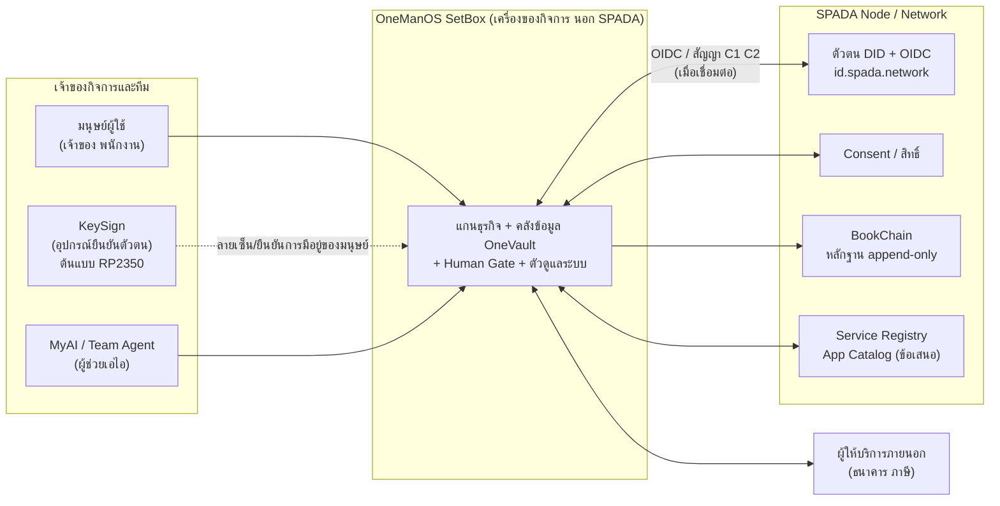

**ข้อสังเกต:** ระบบต้องทำงานพื้นฐานได้แม้ SPADA Bridge ปิด (doc 340 ตามที่ SPD-CUR-001 §12 สรุป) การเชื่อมต่อ SPADA เป็นความสามารถเสริม ไม่ใช่เงื่อนไขการทำงานของ SetBox

---

## ภาพที่ 2 โครงสร้างภายใน SetBox (ชั้นและโมดูล)

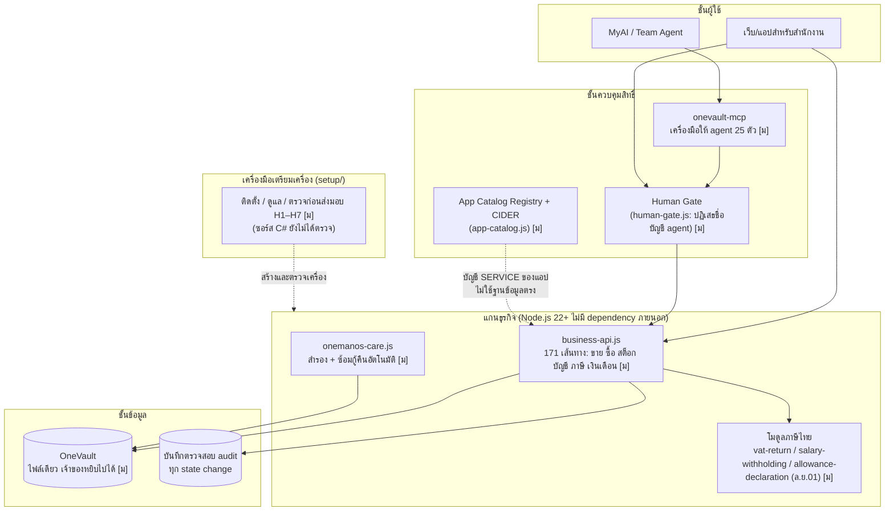

**หลักที่บังคับ (ตามเอกสาร SPD-CUR-001 §9):** Human Gate ปฏิเสธชื่อบัญชี agent · การสำรองต้องซ้อมกู้คืนอัตโนมัติ · คำเตือนไม่มีปุ่มปิด · ตรวจก่อนส่งมอบ H1–H7 ("เครื่องนี้เป็นของเขาแล้วจริงหรือยัง")

---

## ภาพที่ 3 ผังติดตั้งทางกายภาพ (PC1 / PC1+PC2 / PC1+PC2+PCn)

ตาม doc 341/342 ที่ SPD-CUR-001 สรุป: topology มี 3 แบบ เครือข่ายแบ่ง VLAN สเปกเครื่อง `SB-S1`/`SB-D2` และพอร์ต 4105/4106/4107 (ความหมายของแต่ละพอร์ตดู doc 342 ผู้ร่างไม่ได้ตรวจ)

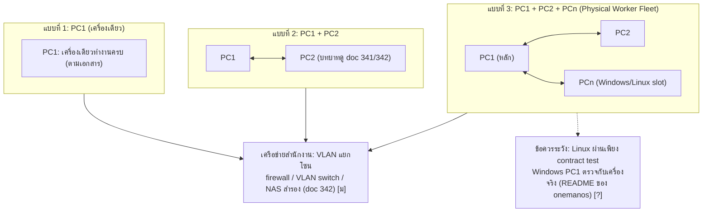

**สถานะที่ต้องยืนยัน:** dTPM หรือ fTPM ค้างตัดสินใจ 10–11 รอบ (D11) ต้องถามผู้ขายเป็นลายลักษณ์อักษรก่อนรับใบเสนอราคา · เกณฑ์ผ่านคือ EK certificate ไม่ใช่ชนิด TPM และห้าม vTPM (ADR 0020)

---

## ภาพที่ 4 โหมดการเชื่อมต่อ: Track S (ไม่เชื่อม SPADA) กับ Track C (เชื่อม SPADA)

SPD-PRC-001 §2 ระบุว่าการติดตั้งมีสองเส้นทางที่เป็นไปได้ทั้งคู่

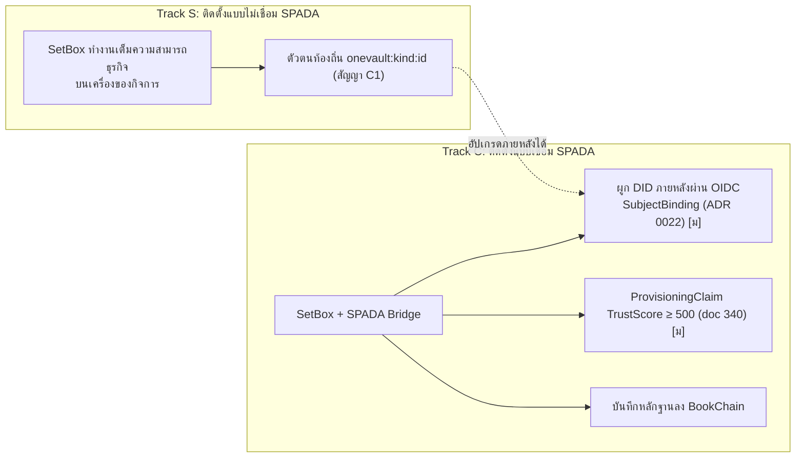

**หลัก:** ระบบนอก SPADA ห้ามสร้าง `did:spada:*` เอง ใช้ `onevault:<kind>:<id>` แล้วผูกด้วย `SubjectBinding` จาก OIDC (สัญญา C1, ADR 0022) · แฮชข้อเท็จจริงใช้ `sha256:` ของ JSON ตาม RFC 8785 (สัญญา C2, ADR 0021)

---

## ภาพที่ 5 ลำดับการติดตั้งและเปิดใช้เครื่อง (Provisioning)

อิงขั้น 0–7 ในคู่มือสมาชิก doc 341 และเส้นทาง `ProvisioningClaim → api-gateway → WorkSpace → Place` ของ doc 340 (ตามที่ SPD-CUR-001 §12 สรุป) ADR 0017 ห้ามเปิดค่า `APPLIANCE` จนกว่า device attestation จะเสร็จ

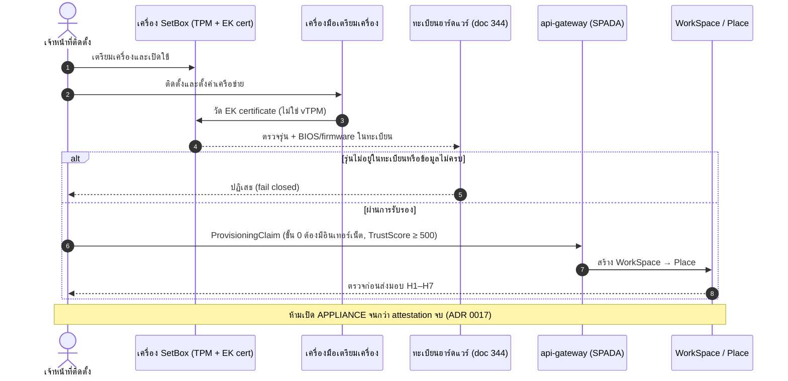

---

## ภาพที่ 6 ขั้นตอนจัดซื้อและรับรองรุ่นฮาร์ดแวร์ (D0–D8)

ตาม SPD-PRC-001 (Lead อนุมัติเป็นมาตรฐาน 2026-09-29 มีผลกับการซื้อหลังได้รับเงินระดมทุน)

```mermaid
flowchart TB
  D0["D0 สเปกขั้นต่ำ"] --> D1["D1 RFQ + คำถามบังคับ<br/>(ลายลักษณ์อักษร)"]
  D1 --> D2["D2 ประเมินคำตอบ"]
  D2 --> D3["D3 ซื้อตัวอย่าง 1–2 เครื่อง"]
  D3 --> D4["D4 วัดและรับรองรุ่น<br/>Steward บันทึกทะเบียน"]
  D5["D5 ออก PO ล็อต"]
  D5 --> D6["D6 ตรวจรับ + สุ่มวัดซ้ำ"]
  D6 --> D7["D7 provision + ติดตั้ง + H1–H7"]
  D7 --> D8["D8 ดูแลหลังขาย<br/>อัปเดต BIOS = รับรองใหม่"]
  D4 -->|"ไม่ผ่าน"| REJ["REJECTED (ทะเบียน append-only)"]
  D4 -->|"ผ่าน"| OK["APPLIANCE-CANDIDATE / NATIVE-ELIGIBLE"]
  OK --> D5
```

**หลัก:** ไม่ผ่านการรับรอง ไม่ออก PO ล็อต · วัดจากเครื่องจริง ไม่เชื่อเอกสารผู้ขายอย่างเดียว · หนึ่งรุ่น + หนึ่งเวอร์ชัน BIOS/firmware = หนึ่งรายการในทะเบียน · แยกหน้าที่ผู้ขอซื้อ ผู้รับรอง ผู้อนุมัติจ่าย

---

## ภาพที่ 7 เส้นทางของ MyAI/Agent และ Human Gate (ภาพแนวคิด ไม่ใช่ลำดับเรียกฟังก์ชันจริง)

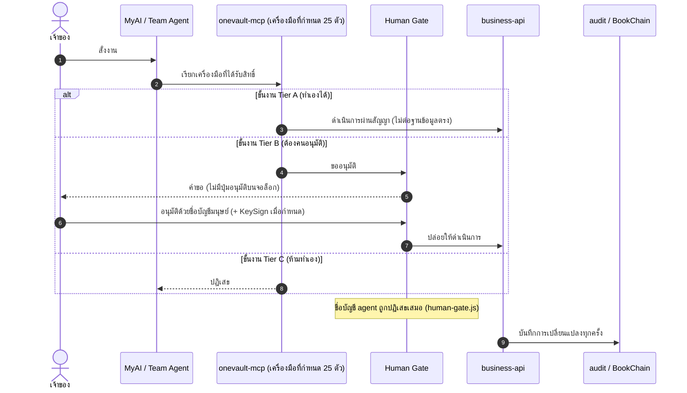

**หมายเหตุ:** Tier A/B/C ตาม doc 263 (SPD-MED-008) · D2.1 Accepted: L5 อิสระเฉพาะ operation ที่ย้อนกลับได้ · กฎเหล็กข้อ 8–9 ของ doc 335 (Entropy Integrity, แยก instruction/data ของ MyAI) **Proposed ยังไม่บังคับใช้ [ข]**

---

## ภาพที่ 8 วงจรชีวิตแอป (CIDER) และประตูมนุษย์ 2 บาน

ตาม SPD-MED-008 §3.2 ที่บันทึกว่าบังคับในโค้ด `app-catalog.js` ข้ามขั้นไม่ได้

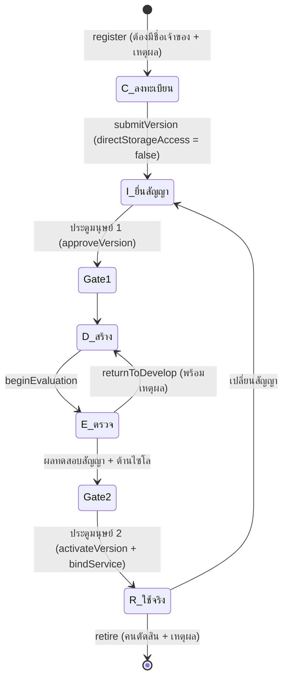

**ด่านเรียกคลัง:** บัญชี SERVICE ของแอปที่ไม่อยู่ในทะเบียนหรือยังไม่ live ถูกปฏิเสธ (`APP_NOT_REGISTERED`, `APP_NOT_LIVE`) ข้อจำกัด: กัน "แอป" ไม่กัน "คนที่เอาบัญชีตัวเองให้แอปใช้"

---

## ภาพที่ 9 ชนิดแอปและเส้นทางขึ้นสโตร์ [ข: ADR 0026 Proposed]

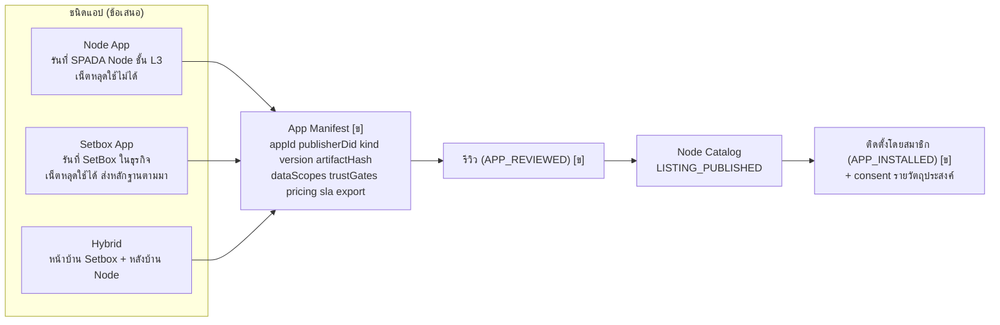

ดูเส้นทางของสมาชิกสร้างแอปเอง และเกณฑ์ผ่านแต่ละขั้น ที่ SPD-PLN-004

---

## ภาพที่ 10 การสำรอง การกู้คืน และการส่งมอบ ("เครื่องนี้เป็นของเขาแล้วจริงหรือยัง")

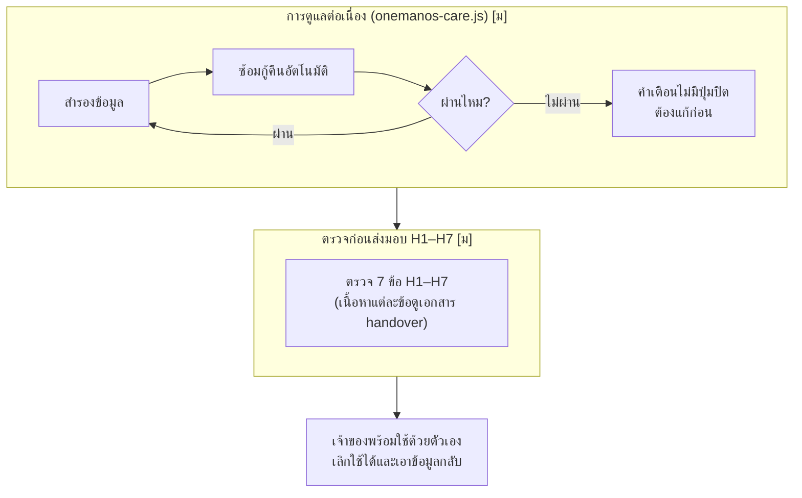

รายละเอียดของข้อ H1–H7 ดูเอกสารส่งมอบ (handover) ของ `onemanos-setbox` ผู้ร่างอ่านเพียงหัวไฟล์ จึงไม่ระบุเนื้อหาแต่ละข้อ

---

## ภาพที่ 11 สถานะความพร้อมของแต่ละส่วน (ตามเอกสาร ณ 2026-10-03)

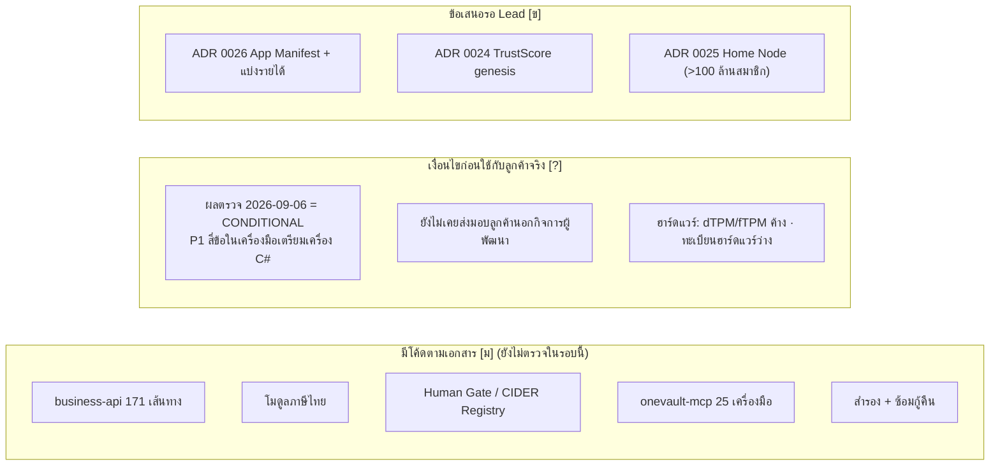

**P1 สี่ข้อของผลตรวจ 2026-09-06 (ตามที่ SPD-CUR-001 §9 บันทึก):** (1) signature/manifest ไม่ fail-closed (2) export ไม่บังคับ preflight (3) ผล encryption/release แสดง PASS เกินหลักฐาน (4) network policy ปฏิเสธแล้วยังเชื่อมต่อ · ไม่ทราบสถานะการแก้ ต้องยืนยันก่อนส่งมอบลูกค้าจริง

---

## ตารางสรุปองค์ประกอบ

| องค์ประกอบ | บทบาท | อยู่ในภาพ | สถานะ |
|---|---|---|---|
| OneVault | คลังข้อมูลฝั่งกล่อง ไฟล์เดียว เจ้าของหยิบไปได้ | 2, 10 | [ม] |
| business-api | ขาย ซื้อ สต็อก บัญชี ภาษี เงินเดือน (171 เส้นทาง) | 2 | [ม] |
| โมดูลภาษีไทย | vat-return, salary-withholding, ล.ย.01 | 2 | [ม] |
| Human Gate | ประตูมนุษย์ ปฏิเสธชื่อบัญชี agent | 2, 7, 8 | [ม] |
| onevault-mcp | เครื่องมือ 25 ตัวให้ agent ใช้ | 2, 7 | [ม] |
| App Catalog Registry + CIDER | วงจรชีวิตแอป ประตูมนุษย์ 2 บาน | 2, 8 | [ม] |
| onemanos-care | สำรองและซ้อมกู้คืน | 2, 10 | [ม] |
| เครื่องมือเตรียมเครื่อง (setup/) | ติดตั้ง ดูแล ตรวจก่อนส่งมอบ H1–H7 | 2, 5, 10 | [ม] แต่ P1 สี่ข้อ |
| ทะเบียนฮาร์ดแวร์ (doc 344) | รับรองรุ่นด้วย EK cert append-only | 5, 6 | [ก] แต่ทะเบียนว่าง |
| KeySign | ยืนยันการมีอยู่ของมนุษย์ ลายเซ็น | 1, 7 | ต้นแบบ RP2350 · ชิปยังไม่ตัดสิน |
| App Manifest / สโตร์ | Node App / Setbox App / Hybrid | 9 | [ข] |
| SPADA Bridge / OIDC | ตัวตน DID, consent, BookChain | 1, 4, 5 | OIDC ตัดสินแล้ว (ADR 0023) แต่ผู้ร่างพบว่ายังไม่มี provider ในโค้ด ณ 2026-09-22 |

---

## คำถามที่ต้องตรวจก่อนนำไปเสนอภายนอก
1. ชื่อไฟล์ จำนวนเส้นทาง (171) และจำนวนเครื่องมือ (25) ยังตรงกับโค้ดล่าสุดหรือไม่ (ตัวเลขมาจากสแนปช็อตเดือนกันยายน)
2. พอร์ต 4105/4106/4107 แต่ละตัวทำอะไร (ผู้ร่างไม่ได้เปิด doc 342)
3. สถานะการแก้ P1 สี่ข้อ และผลตรวจซ้ำ
4. ความหมายของ H1–H7 แต่ละข้อ เพื่อใส่ในภาพที่ 10
5. SetBox รุ่นที่ขายหรือส่งมอบเป็นแบบ Track S หรือ Track C ก่อน
6. เนื้อหาที่ห้ามเผยแพร่ภายนอก: อย่าส่งเอกสารกลุ่ม business-strategy/patents/founder-profile (ตามข้อกำหนดของ `spada-specs`) ก่อน Lead อนุมัติ

## ข้อแก้ไข (errata) หลังเทียบโค้ด 2026-10-03
ดู SPD-ARC-002 สำหรับรายละเอียดทั้งหมด ข้อที่กระทบภาพในเอกสารนี้
- ภาพที่ 2, 7: `onevault-mcp` มีเครื่องมือ **31 ตัว** (ไม่ใช่ 25) รวมกลุ่ม `onevault_app_*` 9 ตัว
- ภาพที่ 1, 4, 11: OIDC provider ของ SPADA **มีโค้ดและเทสต์แล้ว** ใน `spada-monorepo` (ข้อความ "ยังไม่มี provider" ล้าสมัย) แต่ **SetBox ยังไม่ได้เชื่อม** (OIDC ฝั่ง SetBox เป็นแบบทั่วไป ไม่มี SubjectBinding)
- ภาพที่ 5: ฝั่ง SPADA มี `ProvisioningClaim` (ต้อง TrustScore ≥ 500) แต่ **ตัวตรวจ EK certificate ยังไม่มี** (มีเฉพาะ interface และ Null verifier)
- ภาพที่ 3: พอร์ต 4105/4106/4107 ไม่พบในโค้ด (อยู่ใน doc 342)

*ฉบับร่าง v0.1 เขียนโดย Claude เพื่อให้ Lead ตรวจ ยังไม่ผ่านการลงนามหรือรับรอง*
