# คู่มือเริ่มต้นใช้งาน OneManOS Setbox / SPADA OneVault

**สำหรับผู้ที่ยังไม่รู้จักระบบ — เรียนรู้ทีละขั้น**

- **รหัสเอกสาร: SPD-HLP-001** · เวอร์ชัน 0.1 (ร่างเพื่อทบทวน) · ปรับล่าสุด 2026-10-08
- ผู้ร่าง: Claude (AI) จากการอ่านโค้ดและคู่มือของ `onemanos-setbox` (branch `master` คอมมิต `e706ed1`) **ยังไม่มีมนุษย์ทวน และยังไม่ได้ทดสอบทำตามขั้นตอนบนเครื่อง Windows จริงกับผู้ใช้มือใหม่** <!--internal-->
- คู่มือนี้ไม่แทนที่คู่มือภาคสนามเล่ม 1–2 (`docs/OneManOS-Setbox-Field-Manual-TH.md`, `...Vol2-TH.md`) แต่ช่วยให้เข้าใจภาพรวมก่อนไปอ่านเล่มเหล่านั้น

## วิธีอ่านป้ายสถานะ

| ป้าย | ความหมาย |
|---|---|
| ✅ **ยืนยันจากโค้ด** | ยืนยันจากซอร์สโค้ดหรือเอกสารของระบบโดยตรง |
| 🟡 **ร่าง/กำลังพัฒนา** | ยังไม่พร้อมใช้ในรุ่นนี้ หรือเป็นข้อเสนอ |
| ⚪ **ยังไม่ได้ตรวจ** | ผมอ้างตามเอกสาร ไม่ได้ลองทำเอง | <!--internal-->

---

## สารบัญ

1. [ระบบนี้คืออะไร](#1-ระบบนี้คืออะไร)
2. [แนวคิดสำคัญ 6 ข้อ](#2-แนวคิดสำคัญ-6-ข้อ)
3. [ใครทำอะไร (บทบาท)](#3-ใครทำอะไร-บทบาท)
4. [ภาพรวมกระบวนการทั้งหมด](#4-ภาพรวมกระบวนการทั้งหมด)
5. [เลือกรุ่นเครื่อง S / M / L](#5-เลือกรุ่นเครื่อง-s--m--l)
6. [คู่มือติดตั้งทีละขั้น](#6-คู่มือติดตั้งทีละขั้น)
7. [เปิดระบบและใช้หน้าจอ](#7-เปิดระบบและใช้หน้าจอ)
8. [ทำงานกับเอกสาร: สร้าง แก้ไข แนบไฟล์](#8-ทำงานกับเอกสาร-สร้าง-แก้ไข-แนบไฟล์)
9. [AI agent และประตูมนุษย์](#9-ai-agent-และประตูมนุษย์)
10. [สำรองและกู้คืน](#10-สำรองและกู้คืน)
11. [ดูแลรายวัน](#11-ดูแลรายวัน)
12. [ส่งมอบให้เจ้าของใหม่](#12-ส่งมอบให้เจ้าของใหม่)
13. [เมื่อมีปัญหา](#13-เมื่อมีปัญหา)
14. [อภิธานศัพท์เทคนิค](#14-อภิธานศัพท์เทคนิค)
15. [ตารางคำสั่งอ้างอิงเร็ว](#15-ตารางคำสั่งอ้างอิงเร็ว)
16. [สิ่งที่ระบบยังทำไม่ได้ / ยังไม่พร้อม](#16-สิ่งที่ระบบยังทำไม่ได้--ยังไม่พร้อม)

---

## 1. ระบบนี้คืออะไร

**OneManOS Setbox** คือ "กล่องคลังเอกสารและเครื่องยนต์ธุรกิจ" ของกิจการหนึ่งแห่ง ทำงานได้ทั้งหมดบนเครื่องคอมพิวเตอร์เครื่องเดียว ไม่ต้องต่ออินเทอร์เน็ตหลังติดตั้ง และเก็บข้อมูลไว้ในไฟล์ที่เจ้าของกิจการหยิบไปได้ทุกเมื่อ ✅

**SPADA OneVault** คือส่วน "คลังเอกสาร" ในกล่องนั้น (เอกสาร รุ่นของเอกสาร ที่มาที่ไป สิทธิ์ และบันทึกการเปลี่ยนแปลง)

พูดให้ง่าย: คล้ายตู้เอกสารดิจิทัลที่ (1) จำได้ว่าใครแก้อะไรเมื่อไร (2) ให้เฉพาะคนที่มีสิทธิ์เปิดดู (3) มีผู้ช่วย AI ทำงานซ้ำ ๆ ให้ แต่ **อนุมัติเรื่องสำคัญแทนคนไม่ได้** (4) สำรองและกู้คืนได้จริง

### 1.1 ระบบอยู่ตรงไหนในภาพใหญ่

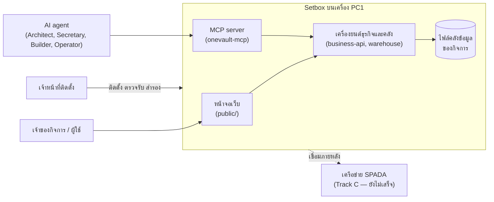

> เส้นประไป SPADA = เส้นทาง **Track C** ซึ่งยังขาดสัญญาตัวตน (C1) และแฮช (C2) 🟡 ส่วน **Track S** (ใช้เดี่ยว ไม่เชื่อม SPADA) ใช้งานได้ตามที่คู่มือนี้อธิบาย

### 1.2 ส่วนประกอบในโฟลเดอร์ (ที่ผู้เริ่มต้นควรรู้จัก)

| ส่วน | หน้าที่ | หมายเหตุ |
|---|---|---|
| `setup/` | เครื่องมือติดตั้ง ตรวจ สำรอง ดูแล ส่งมอบ | **จุดเริ่มต้นของคนติดตั้ง** |
| `public/` | หน้าจอเว็บที่คนใช้จริง | มี 6 หน้า ดูหัวข้อ 7 |
| `warehouse.js` และไฟล์ข้างเคียง | คลังเอกสาร รุ่น ที่มา สิทธิ์ | หัวใจของระบบ |
| `business-api.js` | เครื่องยนต์ธุรกิจ (ขาย ซื้อ สต็อก บัญชี ภาษี เงินเดือน ฯลฯ) | เอกสารระบุ 171 เส้นทาง |
| `onevault-mcp/` | ช่องให้ AI agent ทำงานกับคลังผ่านเครื่องมือที่กำหนด | agent ต่อฐานข้อมูลตรงไม่ได้ |
| `skills/` | คู่มือที่ agent ต้องโหลดตามบทบาท | |
| `kit/launchers/` | ไฟล์ `.cmd` ดับเบิลคลิกสำหรับ Windows | ลำดับ 1→2→3→4 |
| `intake/inbox` | ทางเข้าเอกสารกระดาษที่สแกนแล้ว | |

---

## 2. แนวคิดสำคัญ 6 ข้อ

เข้าใจ 6 ข้อนี้แล้วจะเข้าใจเหตุผลของขั้นตอนที่เหลือทั้งหมด

1. **ข้อมูลเป็นของกิจการ ไม่ใช่ของโปรแกรม** — ก่อนส่งมอบมีการตรวจเจ็ดข้อ (H1–H7) ว่าไม่มีข้อมูลลูกค้ารายอื่นปะปน ✅
2. **ประตูมนุษย์บังคับที่โค้ด** — การปลดระวางระบบเดิม ปิดชุดข้อมูล ปิดงวด และอนุมัติเอกสารที่มีผลทางกฎหมาย ต้องมี "ชื่อคน" และโค้ดปฏิเสธชื่อบัญชี agent ✅
3. **การสำรองที่ไม่เคยลองกู้คืน = ไม่มีสำรอง** — ระบบจึงมี "ซ้อมกู้คืน" อัตโนมัติโดยไม่แตะคลังจริง ✅
4. **คำเตือนต้องหายเองเมื่อแก้ต้นเหตุ** — ไม่มีปุ่มปิดคำเตือน ✅
5. **ไม่มี dependency ภายนอก** — ไม่ต้อง `npm install` ติดตั้งได้ในโรงงานที่ไม่มีเน็ต ✅
6. **ล้มเหลวแบบปิด (fail-closed)** — ถ้า "ไม่รู้" ผลคือ "ไม่ผ่าน" ไม่ใช่ "ผ่าน" เครื่องมือเตรียมเครื่อง (`prep`) ใช้หลักนี้ ✅

---

## 3. ใครทำอะไร (บทบาท)

### 3.1 คนที่เกี่ยวข้อง

| บทบาท | ทำอะไร | ใช้เครื่องมือ |
|---|---|---|
| **ผู้ใช้งานทั่วไป** (เจ้าหน้าที่ของลูกค้า) | สร้าง/แก้/ค้นเอกสาร ตรวจทาน อนุมัติ ลงนาม | หน้าจอเว็บ |
| **ผู้ดูแลฝ่ายลูกค้า** | สำรอง ซ้อมกู้คืน ตั้งค่า ดูแลรายวัน | `onemanos-care.js` / `5-CARE.cmd` |
| **เจ้าหน้าที่ติดตั้ง/ช่าง** | ตรวจเครื่อง ติดตั้ง ตรวจรับ ส่งมอบ | `1-CHECK` ถึง `4-ACCEPT`, `prep`, `handover` |
| **Release Owner** | ลงลายมือชื่อชุดส่งมอบก่อนส่งลูกค้า | `scripts/sign-kit.js` |
| **ผู้พัฒนา/ผู้ประกอบชุด** | ประกอบชุดจาก commit | `scripts/build-kit.js` |

> ผู้ดูแลระบบของ **ฝ่ายลูกค้า** ต้องเป็นบุคคลของลูกค้า (ตรวจในข้อ H5) — ไม่ใช่บัญชีทางลัดของผู้ติดตั้ง ✅

### 3.2 บทบาทในเอกสาร (ใครมีสิทธิ์ทำอะไรกับเอกสารฉบับหนึ่ง)

ระบบกำหนด 10 บทบาท ✅ (`access-control.js`):

| บทบาท | ความหมายโดยย่อ |
|---|---|
| `OWNER` | เจ้าของเอกสาร |
| `CUSTODIAN` | ผู้ดูแลเก็บรักษา |
| `AUTHOR` | ผู้เขียน/ผู้จัดทำ |
| `REVIEWER` | ผู้ตรวจทาน |
| `APPROVER` | ผู้อนุมัติ |
| `SIGNER` | ผู้ลงนาม |
| `PARTNER` | คู่สัญญา/คู่ค้า |
| `RECIPIENT` | ผู้รับเอกสาร |
| `AUDITOR` | ผู้ตรวจสอบ |
| `ADMINISTRATOR` | ผู้ดูแลระบบ |

ความหมายละเอียดของแต่ละบทบาทกำหนดโดยนโยบายสิทธิ์ (`access_policies`) ที่ผู้ดูแลตั้ง

### 3.3 บทบาทของ AI agent (โทเคน)

มี 4 บทบาท ✅ (`onevault-mcp/src/tokens.js`): `architect`, `secretary`, `builder`, `operator` โทเคนหนึ่งใบผูกกับ **เครื่องหนึ่งเครื่อง + บทบาทหนึ่งบทบาท** (ไม่ผูกกับคน) และมีวันหมดอายุ (ค่าตั้งต้นเขียนในโค้ด ตัวอย่างใช้ `--days 90`) ตัวอย่างข้อกำหนดจากใบตรวจรับ: agent ที่ตั้งบทบาท `secretary` ต้องเรียก `onevault_store_canonical` ไม่ได้จริง

---

## 4. ภาพรวมกระบวนการทั้งหมด

### 4.1 วงจรชีวิตตั้งแต่ประกอบชุดจนใช้งานจริง

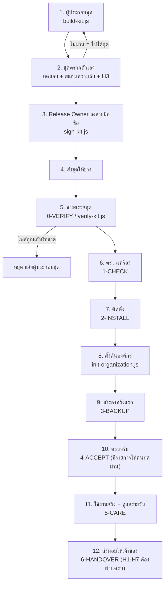

### 4.2 ลำดับเหตุการณ์ตอนติดตั้งหนึ่งครั้ง

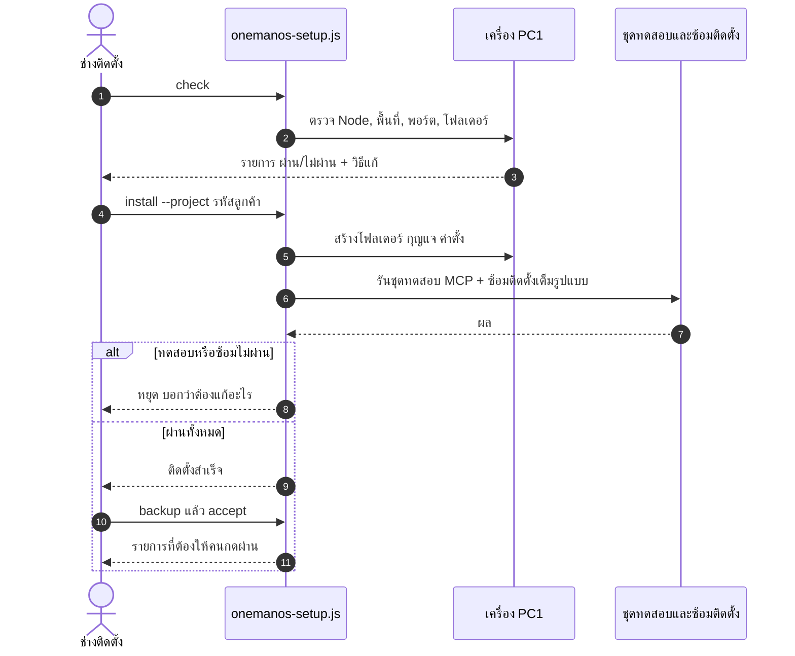

### 4.3 เครื่องมือหลักและหน้าที่ (แผนที่คำสั่ง)

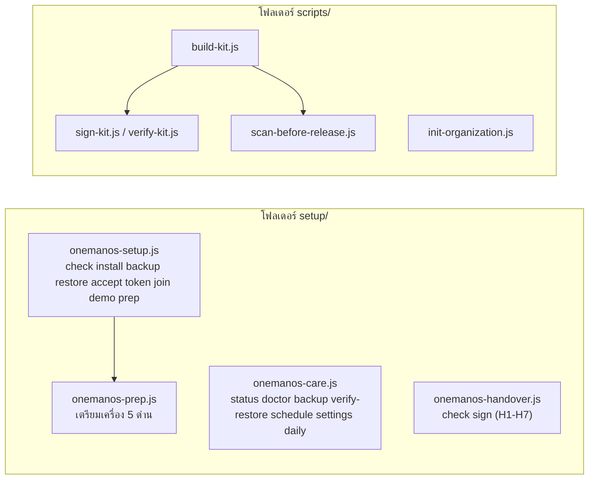

---

## 5. เลือกรุ่นเครื่อง S / M / L

| รุ่น | เครื่อง | เมื่อไรควรใช้ | หมายเหตุ |
|---|---|---|---|
| **S** | PC1 เครื่องเดียว | กิจการเล็ก เริ่มต้น | ติดตั้งสี่คำสั่ง |
| **M** | PC1 + PC2 | ต้องการเครื่องที่สองให้ agent/ทีมใช้ | PC2 ต่อผ่านโทเคน |
| **L** | PC1 + PC2 + PCn | หลายแผนก/หลายเครื่อง | เครื่องเสริมทั้งหมดต่อผ่านโทเคนคนละใบ |

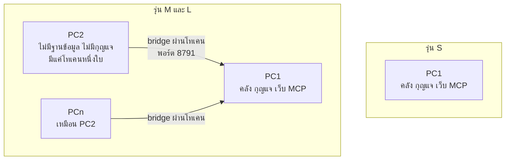

**กฎสามข้อที่ห้ามลืม** ✅ (จาก `kit/START-HERE-TH.md`)

1. **เครื่องเสริมห้ามมีฐานข้อมูล** — ถ้าตั้งฐานข้อมูลบน PC2 "เพื่อให้เร็ว" คือสร้างไซโลรอบใหม่ในบ้านตัวเอง
2. **`AGENT_NOTES.md` ห้ามออกนอก PC1** — มีชื่อตารางและฟิลด์ของลูกค้า
3. **ห้ามเดาค่าที่ขาด** — ข้อมูลจากระบบเดิมสกปรกเสมอ ให้เข้าคิวข้อยกเว้น ค่าที่เดาจะแยกไม่ออกจากข้อมูลจริงในภายหลัง

---

## 6. คู่มือติดตั้งทีละขั้น

> **ก่อนเริ่ม ตรวจสามอย่าง**
> 1. เครื่อง Windows 11 (หรือ Ubuntu 24.04 Desktop) ที่คุณมีสิทธิ์ผู้ดูแล
> 2. **Node.js 22.13 ขึ้นไป** — เปิดหน้าต่างคำสั่งแล้วพิมพ์ `node -v` ต้องขึ้นเลข 22 หรือสูงกว่า (ติดตั้งบน Windows: `winget install OpenJS.NodeJS.LTS`)
> 3. ได้รับชุดติดตั้งที่ **ลงลายมือชื่อแล้ว** และได้รับลายนิ้วมือกุญแจ/ package hash **ทางช่องทางอื่น** (ไม่ใช่ในชุดเอง)
>
> บน Windows ไม่ต้องพิมพ์คำสั่งก็ได้ ดับเบิลคลิกไฟล์ใน `kit\launchers\` ตามลำดับ **1-CHECK → 2-INSTALL → 3-BACKUP → 4-ACCEPT** และรอให้แต่ละไฟล์เสร็จก่อนเริ่มไฟล์ถัดไป ทุกครั้งที่รันจะมีไฟล์บันทึกในโฟลเดอร์ `logs` ให้ส่งกลับทั้งโฟลเดอร์เมื่อเสร็จ
> ถ้าตัวหนังสือไทยบนจอเป็นกล่อง นั่นคือเรื่องฟอนต์ ไม่ใช่ข้อผิดพลาด เปิดไฟล์บันทึกด้วย Notepad แทน

### ขั้น 0 · แตกชุดและตรวจว่าชุดครบ ไม่ถูกแก้

1. แตกไฟล์ชุดลงโฟลเดอร์ **เปล่า** เช่น `C:\OneManOS\`
2. ดับเบิลคลิก `kit\launchers\0-VERIFY.cmd` (หรือสั่ง `node scripts/verify-kit.js`)
3. **สิ่งที่ควรเห็น:** ชุดตรงกับ `MANIFEST.json` ทุกไฟล์ และลายมือชื่อตรง
4. **ถ้าไม่ผ่าน:** หยุด อย่าติดตั้ง แจ้งผู้ส่งชุด (ชุดอาจเสียหายหรือถูกแก้)

### ขั้น 1 · ตรวจเครื่อง (`check`) — ไม่แก้อะไรเลย

```
node setup/onemanos-setup.js check
```

- ตรวจ Node, พื้นที่ดิสก์, พอร์ต, ความพร้อมโฟลเดอร์
- ผลแต่ละบรรทัด: `✓` ผ่าน · `✗` ไม่ผ่าน (บอก "แก้อย่างไร") · `!` เตือน
- **ต้องผ่านทุกข้อก่อนไปขั้นถัดไป**
- ตั้งชื่อเครื่องตรงกับบทบาท (`onevault-pc1`) ใช้ไอพีคงที่ และเวลาทุกเครื่องต่างกันไม่เกิน 1 วินาที (เพราะเลขที่เอกสารคำนวณกุญแจงวดจากเวลา ถ้าเวลาเพี้ยนข้ามเที่ยงคืนสิ้นเดือน เอกสารจะตกงวดผิด) ✅

### ขั้น 2 · ติดตั้ง (`install`)

```
node setup/onemanos-setup.js install --project <รหัสลูกค้า>
```

- `<รหัสลูกค้า>` คือรหัสโปรเจกต์ของลูกค้ารายนี้ เช่น `ลูกค้า-ก` (ตัวอย่างในคู่มือเดิม)
- คำสั่งนี้สร้างโฟลเดอร์ กุญแจ ค่าตั้ง แล้ว **รันชุดทดสอบ MCP และซ้อมติดตั้งเต็มรูปแบบให้เอง**
- **ถ้าชุดทดสอบหรือการซ้อมไม่ผ่าน ห้ามไปต่อ** ให้แก้ตามข้อความที่ขึ้น
- ห้ามใช้ `--skip-rehearsal` ในการติดตั้งจริง
- จำนวนขั้นของการซ้อมในเอกสารไม่ตรงกัน (21 ใน README และใบตรวจรับ, 22 ใน START-HERE) ผมไม่ได้ตรวจว่าตัวไหนถูก ⚪ <!--internal-->

### ขั้น 3 · ตั้งต้นองค์กร

```
node scripts/init-organization.js --entity <รหัส> --name "<ชื่อตามหนังสือรับรอง>" --tax-id <เลข13หลัก> --apply
```

| ตัวเลือก | ความหมาย |
|---|---|
| `--entity` | รหัสนิติบุคคล ใช้ a-z 0-9 และขีดกลาง เช่น `acme-trading` |
| `--name` | ชื่อเต็มตามหนังสือรับรอง |
| `--tax-id` | เลขประจำตัวผู้เสียภาษี 13 หลัก (ไม่ใส่ได้ สถานะจะเป็น "รอยืนยัน") |
| `--evidence` | หลักฐานที่ใช้ยืนยัน |
| `--admin` | ผูกบัญชีผู้ดูแลเข้ากับนิติบุคคลนี้ |
| `--status` | ดูความพร้อมของทุกองค์กรในคลัง แล้วจบ |
| `--apply` | **เขียนจริง** (ไม่ใส่ = แสดงว่าจะทำอะไรเท่านั้น) |

**แนะนำ:** รันครั้งแรก *ไม่ใส่* `--apply` เพื่อดูก่อนว่าจะทำอะไร แล้วค่อยรันซ้ำพร้อม `--apply`

### ขั้น 4 · สำรองครั้งแรก (`backup`)

```
node setup/onemanos-setup.js backup
```

ระบบสำรองคลังพร้อมลายนิ้วมือ (hash) และ **ตรวจสำเนาทันที** (`--keep 14` เก็บสำเนา 14 ชุดล่าสุด)

### ขั้น 5 · ตรวจรับ (`accept`)

```
node setup/onemanos-setup.js accept
```

- ตรวจทั้งชุด และ **ออกรายการที่ต้องให้คนกดผ่าน** — ข้อที่ระบุว่าต้องมีคนเซ็นชื่อ (🔒 ในใบตรวจรับ `kit/CHECKLIST-TH.md`) agent ทำแทนไม่ได้
- พิมพ์ใบตรวจรับ (`kit/CHECKLIST-TH.md`) ออกมาติ๊กด้วยปากกา หนึ่งใบต่อหนึ่งลูกค้า

### ขั้น 6 (ไม่บังคับ) · ข้อมูลตัวอย่างสมมติ

```
node setup/onemanos-setup.js demo            # สร้างใน demo-synthetic/ แยกจากคลังจริง
node setup/onemanos-setup.js demo --remove   # ลบทิ้งด้วยคำสั่งเดียว
```

**ลบตัวอย่างก่อนเริ่มใช้งานจริงเสมอ** (คลังจริงไม่ถูกแตะ)

### ขั้น 7 (เฉพาะรุ่น M/L) · เพิ่มเครื่องเสริม

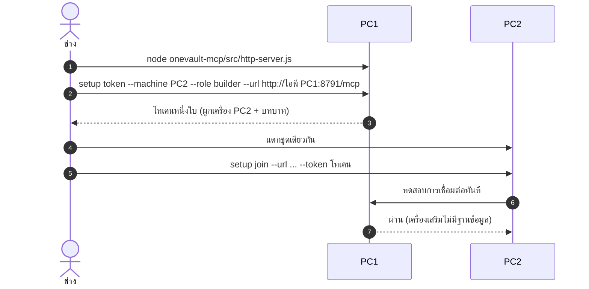

คำสั่งอื่น: `token list` ดูรายการ · `token revoke --jti <รหัส>` เพิกถอน (เครื่องนั้นเรียกไม่ได้ทันที) · ใช้โทเคน **คนละใบทุกเครื่อง** · เปิดพอร์ต 8791 เฉพาะช่วงไอพีของวงแลนลูกค้า ไม่ใช่ทั้งโลก (รายละเอียดที่ `onevault-mcp/AUTH-TH.md`)

### ขั้น 8 (แยกต่างหาก) · เตรียมเครื่อง `prep` — ห้าด่าน

`prep` ออก "หลักฐาน" ว่าเครื่องและชุดพร้อมหรือไม่ ✅ (ทำงานแยกจากการติดตั้ง)

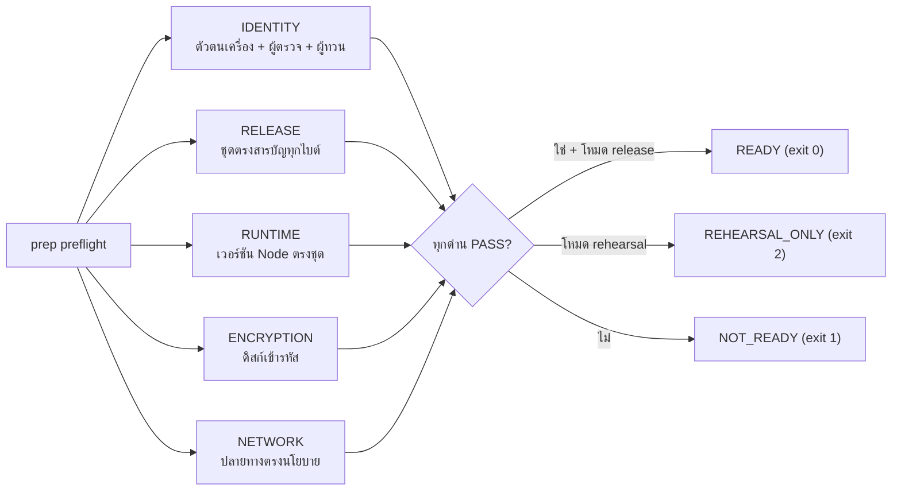

- สถานะผลตรวจ: `PASS` ผ่าน · `REVIEW` ตรวจไม่ได้/หลักฐานไม่ครบ **ห้ามถือเป็นผ่าน** · `BLOCK` ไม่ผ่านชัดเจน
- โหมด `rehearsal` (ค่าตั้งต้น) ใช้ซ้อมกับข้อมูลสังเคราะห์ **ผลซ้อมไม่ใช่สิทธิ์ปล่อย** · โหมด `release` ต้องมี `--pin-fingerprint` และ `--approved-hash` ที่ได้รับ **คนละช่องทางกับชุด**
- หลักฐานเก่ากว่า 24 ชั่วโมงถือว่าไม่พร้อม
- **ข้อจำกัดสำคัญ:** ตัวตนเครื่องมาจากรหัสติดตั้งของระบบปฏิบัติการ **ไม่ใช่ TPM/EK** จึงไม่ใช่ hardware attestation ตัวตรวจ attestation จริงยังไม่มีในโค้ด 🟡 (ดูหัวข้อ 16)
- รายละเอียดคำสั่งเต็ม: `docs/OneManOS-Setbox-Prep-TH.md`

---

## 7. เปิดระบบและใช้หน้าจอ

### 7.1 เปิดเซิร์ฟเวอร์

```
node server.js          # หรือ npm start
```

- ค่าตั้งต้นฟังที่ `http://127.0.0.1:8080` (พอร์ตเปลี่ยนด้วยตัวแปร `PORT`) — **ตั้งใจให้เข้าถึงได้จากเครื่องนี้เท่านั้น** การเปิดออกเครือข่ายต้องตั้ง `HOST` เองอย่างจงใจ ✅
- ถ้าเปิดออกเครือข่ายแล้วไม่มี TLS หรือมีการเข้าสู่ระบบแบบพัฒนา ระบบจะพิมพ์ **คำเตือน** ตอนเริ่ม
- วิธีที่ตัวติดตั้งตั้งให้เซิร์ฟเวอร์เริ่มเองเมื่อเปิดเครื่อง: สอบถามช่างหรือดูคู่มือภาคสนามเล่ม 2

### 7.2 แผนที่หน้าจอ

| หน้า | ไฟล์ | ใช้ทำอะไร |
|---|---|---|
| หน้าหลัก (Workbench) | `index.html` | ภาพรวม, ค้นหาเอกสาร, ระบบบริหารเอกสาร, กล่องงานตรวจทาน/อนุมัติ, กล่องงานลงนาม, ค้นหาเนื้อหา OCR, นำเข้าและตรวจย้อนหลัง |
| ผู้ดูแลระบบ | `admin.html` | งานของผู้ดูแล |
| งานธุรกิจ | `business.html` | เครื่องยนต์ธุรกิจ |
| ภาพรวมผู้บริหาร | `executive.html` | ภาพสรุปสำหรับผู้บริหาร |
| ข้อมูลของฉัน | `me.html` | ข้อมูลของผู้ใช้คนนั้น |

เมนูซ้ายของหน้าหลักยังมีกลุ่ม "ย้ายระบบเดิม" (สำรวจฐานข้อมูลต้นทาง, ออกแบบการเชื่อมโยง, ตัวอย่างเอกสาร, ตรวจสอบความถูกต้อง, รายการข้อยกเว้น, กระทบยอดข้อมูล)
🟡 ใน PR #12 ของ `onemanos-setbox` หน้าเหล่านี้จะแสดง **ป้ายเตือนข้อมูลสาธิต** ว่าตัวเลขตัวอย่างไม่ใช่ผลของฐานข้อมูลของคุณ <!--internal-->

### 7.3 เข้าสู่ระบบ

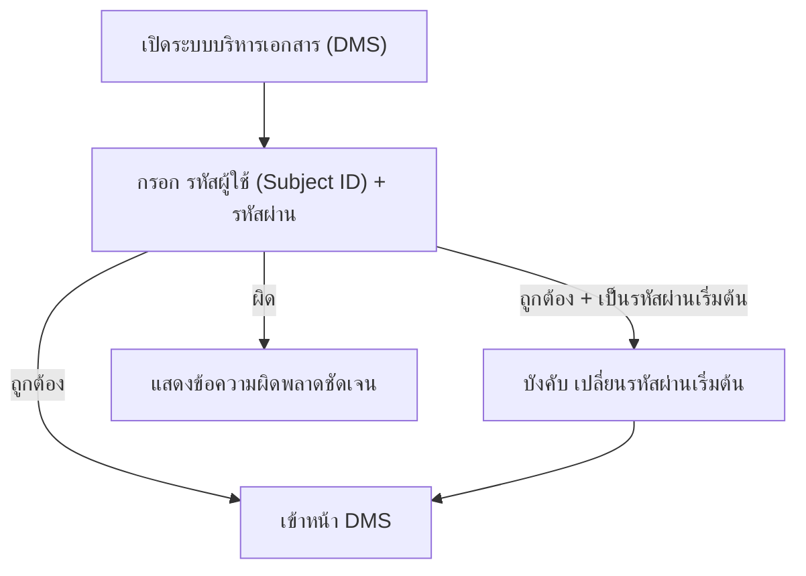

- บัญชีถูกสร้างโดย **ผู้ดูแลที่ตั้งบัญชีให้** ผู้ใช้สร้างเองไม่ได้
- การเข้าสู่ระบบด้วยรหัสผ่านในเครื่องเป็นของ **ชั่วคราวจนกว่า OIDC จะพร้อม** ✅ (ตามคอมเมนต์ในโค้ด)
- ตัวเลือก "เข้าสู่ระบบแบบพัฒนา" (`DMS_DEV_AUTH`) มีไว้ทดสอบ **ห้ามเปิดในระบบจริง** ระบบจะเตือนเมื่อเริ่ม

---

## 8. ทำงานกับเอกสาร: สร้าง แก้ไข แนบไฟล์

### 8.1 หลักคิด: ทุกการแก้ = เวอร์ชันใหม่

เอกสารไม่ถูกเขียนทับ ทุกการแก้เป็น **เวอร์ชันใหม่** พร้อม "เหตุผลการเปลี่ยนแปลง" และ `expectedVersion` เพื่อกันสองคนแก้ชนกัน (ระบบปฏิเสธเวอร์ชันที่ชน) ✅

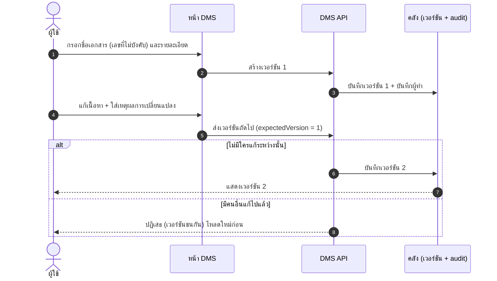

### 8.2 สร้างเอกสารใหม่

**ในรุ่นปัจจุบัน** ✅: หน้า DMS มีช่อง ประเภทเอกสาร (ค่าตั้งต้น `GeneralDocument`) · ชื่อเอกสาร · เลขที่เอกสาร · **เนื้อหา JSON** (ต้องพิมพ์เป็น JSON เอง)

**ใน PR #12 (ยังไม่ merge)** 🟡: เปลี่ยนเป็นฟอร์มธรรมดา — ชื่อ, เลขที่ (ไม่บังคับ), รายละเอียดแบบข้อความ — ไม่ต้องเขียน JSON สำหรับ `GeneralDocument` <!--internal-->

ขั้นตอน:
1. เข้าสู่ระบบ → เมนู "ระบบบริหารเอกสาร"
2. ในกล่อง "สร้างเอกสารใหม่" กรอกข้อมูล แล้วสร้างเวอร์ชัน 1
3. เอกสารปรากฏในรายการ "เอกสารที่มีสิทธิ์เห็น" (เห็นเฉพาะที่คุณมีสิทธิ์)

### 8.3 แก้ไขเอกสาร

1. เปิดเอกสารจากรายการ
2. ในส่วน "แก้ไขเป็นเวอร์ชันใหม่" แก้เนื้อหา และ **ใส่เหตุผลการเปลี่ยนแปลง** (บังคับ)
3. บันทึก → ได้เวอร์ชันถัดไป ถ้าระบบแจ้งเวอร์ชันชน ให้เปิดเอกสารใหม่แล้วแก้ซ้ำ

### 8.4 แนบไฟล์ (PDF / รูปภาพ)

ในส่วน "ไฟล์แนบและ Preview" เลือกไฟล์แล้วอัปโหลด เอกสารกระดาษที่สแกนแล้วให้วางที่ `intake/inbox` (ทางเข้าเอกสาร)

### 8.5 ตรวจทาน อนุมัติ ลงนาม

- เมนู "กล่องงานตรวจทาน/อนุมัติ" และ "กล่องงานลงนาม" แสดงงานที่รอคุณตามบทบาทในเอกสาร (REVIEWER, APPROVER, SIGNER)
- **การลงนาม** ต้องตั้งผู้ให้บริการลงนามให้เรียบร้อยก่อนจึงจะใช้ได้
- งานที่มีผลทางกฎหมายต้องมี **ชื่อคน** (ประตูมนุษย์ ดูหัวข้อ 9)

### 8.6 ค้นหา

- "ค้นหาเอกสาร" ค้นข้อมูลของเอกสาร · "ค้นหาเนื้อหา OCR" ค้นข้อความในไฟล์สแกน
- ดัชนีค้นหา **สร้างใหม่ได้** และไม่แก้เอกสารต้นฉบับ ✅ (ข้อความบนหน้าจอ)

---

## 9. AI agent และประตูมนุษย์

### 9.1 agent ทำงานกับคลังอย่างไร

agent ไม่แตะฐานข้อมูลตรง ต้องผ่าน MCP server และ "เครื่องมือที่กำหนด" เท่านั้น (ชื่อขึ้นต้น `onevault_`) เช่น สร้างเอกสาร (`onevault_create_document`), ค้นเอกสาร (`onevault_query_documents`), เก็บเอกสารต้นฉบับ (`onevault_store_canonical`), ยื่นข้อยกเว้น (`onevault_raise_exception`), อ่านบันทึกการตรวจสอบ (`onevault_get_audit`), เริ่ม/ปิดผนึกรอบย้ายข้อมูล (`onevault_start_wave`, `onevault_seal_wave`) และกลุ่มวงจรแอป (`onevault_app_*`)

เอกสารระบุว่ามีเครื่องมือ 25 ตัว แต่ผมนับชื่อ `onevault_*` ในซอร์สได้ 35 ชื่อ (รวมกลุ่มแอปและงานธุรกิจ) ยังไม่ได้ตรวจว่านับต่างกันเพราะอะไร ⚪ <!--internal-->

### 9.2 ประตูมนุษย์ (Human Gate)

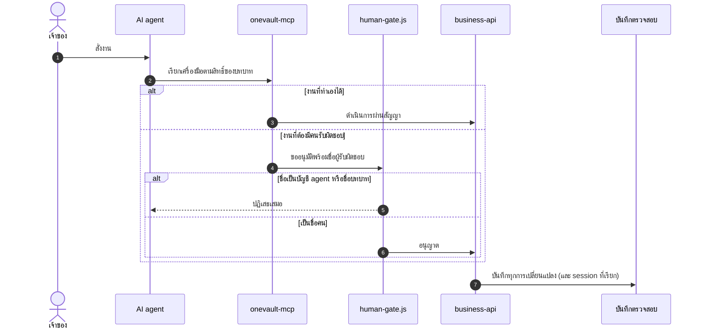

ประตูนี้ปฏิเสธเฉพาะรูปแบบที่ระบบสร้างเอง: `agent:<เครื่อง>`, `agent:unknown`, ชื่อบทบาท (architect/secretary/builder/operator), ชื่อที่ตรงกับ session ที่เรียกอยู่, ชื่อของ identity ชนิด `SERVICE` และข้อความที่ไม่มีตัวอักษรเลย ✅

**ข้อจำกัดที่ต้องรู้:** ประตูนี้ **พิสูจน์ไม่ได้ว่าคนที่ชื่อนั้นกดเองจริง** มันปิดทางที่ agent จะใส่ชื่อตัวเองตรง ๆ และบันทึก session ที่เรียกไว้ให้ตรวจย้อนหลัง การยืนยันตัวตนด้วยอุปกรณ์ KeySign ยังเป็นข้อเสนอ 🟡

### 9.3 วงจรชีวิตแอป (CIDER) และประตูมนุษย์ 2 บาน

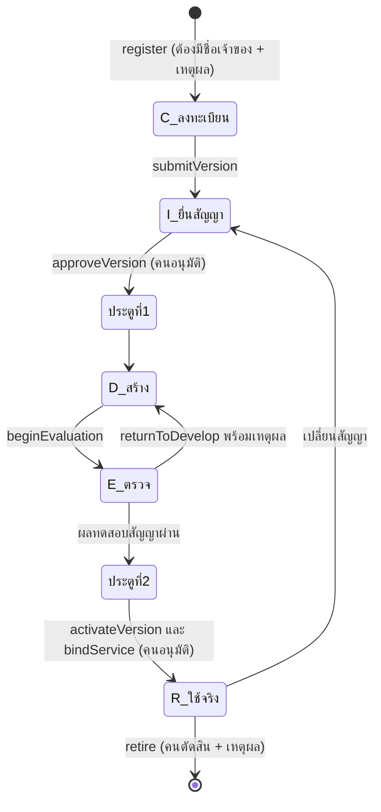

C = Concept/ลงทะเบียน · I = Infra/ยื่นสัญญา · D = Develop · E = Evaluate · R = Release · ข้ามขั้นไม่ได้ และแอปที่ไม่อยู่ในทะเบียนหรือยังไม่ live เรียกคลังไม่ได้ (`APP_NOT_REGISTERED`, `APP_NOT_LIVE`) ✅

### 9.4 ขั้นความเสี่ยงของงาน (Tier A/B/C)

| Tier | ความหมาย | ใครทำได้ |
|---|---|---|
| **A** | ย้อนกลับได้ ทำได้ทันที | MyAI/agent |
| **B** | ต้องมนุษย์อนุมัติ | คนที่ระบุชื่อ |
| **C** | ห้ามให้ AI ทำเอง | คนเท่านั้น |

(กรอบนี้เป็นข้อเสนอ 🟡 ส่วนประตูมนุษย์ในโค้ดบังคับที่ `human-gate.js` และทะเบียนแอป)

---

## 10. สำรองและกู้คืน

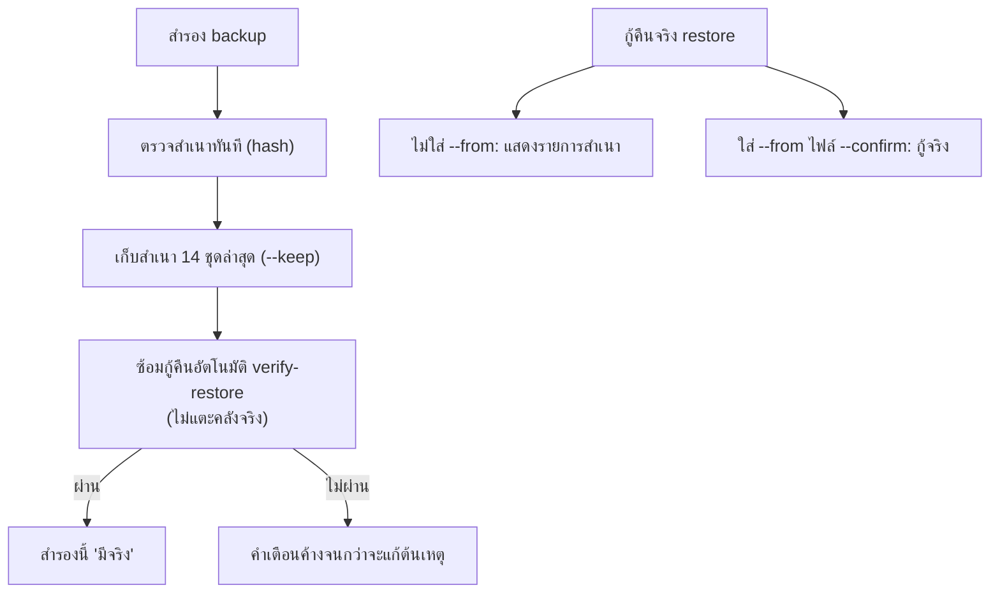

- สำรอง: `node setup/onemanos-setup.js backup` · กู้คืน: `restore` (ไม่ใส่ `--from` = แสดงรายการสำเนา; ต้องมี `--confirm` จึงกู้จริง) ✅
- ซ้อมกู้คืน: `node setup/onemanos-care.js verify-restore` (ไม่แตะข้อมูลจริง) ✅
- ตั้งสำรองอัตโนมัติทุกวัน: `node setup/onemanos-care.js schedule --time 22:00` (ทำครั้งเดียว; ยกเลิกด้วย `schedule --off`) ✅
- **ห้ามเก็บสำเนาไว้เครื่องเดียวกับคลังเท่านั้น** (คำแนะนำทั่วไป)

🟡 **PR #14 (ยังเป็น draft):** สำรองปัจจุบันบันทึกเฉพาะฐานข้อมูล PR นี้เพิ่มการเก็บไฟล์แนบ/ไฟล์ canonical ไว้ข้าง snapshot (`.db`, `.db.json`, `.db.files/` ต้องเก็บไว้ด้วยกัน), ตรวจ snapshot ก่อนกู้ และการกู้คืนเป็นงาน **ออฟไลน์** (หยุดผู้ใช้ก่อน) ยังไม่ผ่านการตรวจโดยผู้ตรวจอิสระ **ก่อน merge ห้ามเชื่อว่าสำรองครอบคลุมไฟล์แนบ** <!--internal-->

---

## 11. ดูแลรายวัน

ผู้ดูแลฝ่ายลูกค้าใช้ `onemanos-care.js` (หรือดับเบิลคลิก `5-CARE.cmd` เมนูภาษาไทย) ✅

| คำสั่ง | ใช้เมื่อ |
|---|---|
| `status` | ดูสถานะทั้งระบบในหน้าเดียว |
| `doctor` | ตรวจสุขภาพละเอียด พร้อมวิธีแก้ทุกข้อ |
| `backup` | สำรองเดี๋ยวนี้ |
| `verify-restore` | ซ้อมกู้คืนจากสำเนาล่าสุด |
| `schedule [--time 22:00]` | ตั้งสำรองอัตโนมัติ (ครั้งเดียว) |
| `settings [--set KEY=ค่า]` | ดู/แก้ค่าตั้งที่ลูกค้าแก้ได้เอง (ค่าที่ไม่ใช่ของลูกค้าแก้ไม่ได้) |
| `daily` | งานประจำคืน (ตัวตั้งเวลาเรียกเอง ไม่ต้องสั่ง) |

**หลักการ:** ทุกคำเตือนมีวิธีแก้ และจะหายเองเมื่อแก้แล้ว ไม่มีปุ่มปิด

---

## 12. ส่งมอบให้เจ้าของใหม่

```
node setup/onemanos-handover.js check
node setup/onemanos-handover.js sign --to "<เจ้าของใหม่>" --by "<คนส่งมอบ>"
```

**ต้องผ่านครบเจ็ดข้อ** `sign` ไม่มีตัวเลือกให้ข้าม ✅

| ข้อ | ตรวจอะไร |
|---|---|
| H1 | โปรเจกต์และชื่อกิจการเป็นของลูกค้า |
| H2 | ไม่มีข้อมูลของลูกค้ารายอื่นในคลัง |
| H3 | ไม่มีร่องรอยของลูกค้ารายอื่นในชุดไฟล์ |
| H4 | ไม่มีโทเคนของเครื่องอื่นที่ยังใช้ได้ |
| H5 | ไม่มีบัญชีทางลัด และมีผู้ดูแลของลูกค้า |
| H6 | สำรองมีจริง และเคยกู้คืนได้จริง |
| H7 | บันทึกครบ และกุญแจอยู่ที่เครื่องนี้ |

---

## 13. เมื่อมีปัญหา

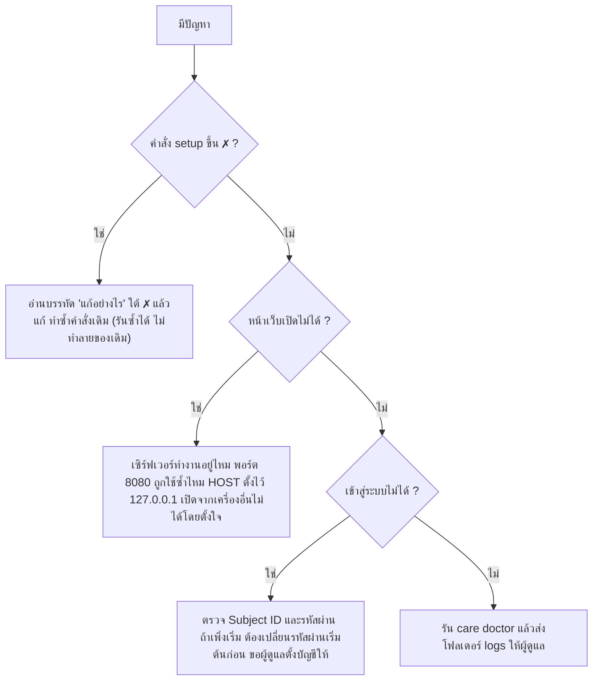

| อาการ | สาเหตุที่น่าจะเป็น | ทำอย่างไร |
|---|---|---|
| `node -v` ต่ำกว่า 22 | Node เก่า | ติดตั้ง Node 22+ (`winget install OpenJS.NodeJS.LTS`) |
| `0-VERIFY` ไม่ผ่าน | ชุดเสียหาย/ถูกแก้/ไม่ได้ลงลายมือชื่อ | หยุด ขอชุดใหม่ อย่าติดตั้ง |
| ตัวอักษรไทยเป็นกล่อง | ฟอนต์คอนโซล | เปิดไฟล์ใน `logs` ด้วย Notepad |
| `prep` ได้ `REVIEW` | ตรวจไม่ได้หรือหลักฐานไม่ครบ | ห้ามถือเป็นผ่าน หาสาเหตุ (เช่น การตรวจ BitLocker ต้องรันด้วยสิทธิ์ผู้ดูแล) |
| เอกสารตกงวดผิดเดือน | เวลาเครื่องเพี้ยน | ตั้งเวลาให้ตรง (ต่างกันไม่เกิน 1 วินาที) |
| ติดตั้งผ่านแต่ชุดทดสอบ/ซ้อมไม่ผ่าน | ปัญหาของเครื่อง/ชุด | ห้ามไปต่อ แก้ตามข้อความ |
| `403 APP_NOT_REGISTERED` | แอปไม่อยู่ในทะเบียน | ลงทะเบียนและผ่านประตูมนุษย์ตามวงจร CIDER |
| เวอร์ชันเอกสารชนกัน | มีคนแก้ไปแล้ว | เปิดเอกสารใหม่ แล้วแก้ซ้ำ |

ถ้าอ่านข้อความผิดพลาดแล้วไม่รู้ว่าต้องทำอะไรต่อ ถือว่าเป็นข้อบกพร่องของระบบ ให้แจ้งทีมพัฒนา ✅ (หลักการในคู่มือเดิม)

---

## 14. อภิธานศัพท์เทคนิค

### 14.1 ผลิตภัณฑ์และโครงสร้าง

| คำ | ความหมาย |
|---|---|
| **OneManOS Setbox** | กล่อง/ชุดคลังเอกสารและเครื่องยนต์ธุรกิจของกิจการหนึ่งแห่ง ทำงานบนเครื่องเดียวได้ |
| **OneVault** | ส่วนคลังเอกสาร: เอกสาร รุ่น ที่มาที่ไป สิทธิ์ บันทึกการตรวจสอบ |
| **SPADA** | กรอบแนวคิดและเครือข่ายใหญ่ (Sovereign Personal Agent Digital Architecture) ที่ Setbox จะเชื่อมในอนาคต |
| **PC1 / PC2 / PCn** | เครื่องหลัก (มีคลัง กุญแจ) / เครื่องเสริม (ไม่มีฐานข้อมูล ต่อผ่านโทเคน) |
| **รุ่น S / M / L** | PC1 เดี่ยว / PC1+PC2 / PC1+PC2+PCn |
| **Track S / Track C** | ใช้เดี่ยวไม่เชื่อม SPADA / เชื่อม SPADA (Track C ยังขาด C1, C2) |
| **DMS** | Document Management System ระบบบริหารเอกสาร (หน้าจอใน Setbox) |
| **Workbench** | หน้าหลักของ OneVault ที่มีเมนูทั้งหมด |
| **GeneralDocument** | ประเภทเอกสารทั่วไปที่สร้างจากฟอร์มได้ |
| **คลัง (warehouse)** | โมดูลที่เก็บเอกสารและรุ่น |
| **intake/inbox** | โฟลเดอร์รับไฟล์สแกนเข้าระบบ |

### 14.2 ชุดส่งมอบและความน่าเชื่อถือ

| คำ | ความหมาย |
|---|---|
| **Kit (ชุดส่งมอบ)** | แพ็กเกจที่ประกอบจาก commit เพื่อส่งลูกค้า ไม่ใช่ห้องทำงานของผู้พัฒนา |
| **Manifest (`MANIFEST.json`)** | สารบัญไฟล์ในชุด พร้อมค่า hash ของแต่ละไฟล์ |
| **hash / SHA-256** | ลายนิ้วมือของข้อมูล เปลี่ยนไบต์เดียว ค่าเปลี่ยนทั้งหมด ใช้ตรวจว่าไฟล์ถูกแก้ |
| **Package hash** | hash ของทั้งชุด ใช้ยืนยันว่าเป็นชุดที่อนุมัติ |
| **Release ID** | รหัสรุ่นที่ Release Owner อนุมัติ |
| **ลงลายมือชื่อ (sign)** | ใช้กุญแจส่วนตัวเซ็นชุด ผู้รับตรวจด้วยกุญแจสาธารณะ |
| **Fingerprint (กุญแจ)** | ลายนิ้วมือของกุญแจสาธารณะ ต้องได้มาคนละช่องทางกับชุด |
| **Provenance** | ที่มา: เอกสาร/ชุดมาจาก commit ไหน ใครทำ เมื่อไร |
| **DCO** | Developer Certificate of Origin การรับรองของมนุษย์ว่ามีสิทธิ์ส่งโค้ด (`Signed-off-by`) |
| **Fail-closed** | ถ้าไม่แน่ใจ = ไม่ผ่าน |

### 14.3 ผลตรวจและการเตรียมเครื่อง

| คำ | ความหมาย |
|---|---|
| **PASS / REVIEW / BLOCK** | ผ่าน / ตรวจไม่ได้ ห้ามถือเป็นผ่าน / ไม่ผ่านชัดเจน |
| **READY / REHEARSAL_ONLY / NOT_READY** | ผลรวมของ preflight (exit 0 / 2 / 1) |
| **TRUSTED / REVIEW / NOT_TRUSTED** | ผลของ `prep compare` (exit 0 / 2 / 1) |
| **Evidence (หลักฐาน)** | ไฟล์ JSON ผลตรวจที่ผูกกับชุด เครื่อง ผู้ตรวจ และเวลา |
| **Attestation** | การพิสูจน์ด้วยฮาร์ดแวร์ว่าเครื่องคือเครื่องที่อ้าง (ผ่าน TPM) ยังไม่มีตัวตรวจในโค้ด |
| **TPM / EK / vTPM** | ชิปความปลอดภัย / ใบรับรองกุญแจของชิป / TPM จำลอง (ต้องปฏิเสธ) |
| **dTPM / fTPM** | TPM แยกชิป / TPM ในเฟิร์มแวร์ (รอการตัดสินเกณฑ์) |
| **H1–H7** | เจ็ดข้อก่อนส่งมอบ (ดูหัวข้อ 12) |
| **BitLocker** | การเข้ารหัสดิสก์ของ Windows ที่ด่าน ENCRYPTION ตรวจ |

### 14.4 ข้อมูลและเอกสาร

| คำ | ความหมาย |
|---|---|
| **Version (เวอร์ชัน)** | รุ่นของเอกสาร ทุกการแก้สร้างรุ่นใหม่ ไม่เขียนทับ |
| **expectedVersion** | เวอร์ชันที่ผู้แก้เชื่อว่ากำลังแก้ ถ้าไม่ตรงกับปัจจุบัน = ชน ระบบปฏิเสธ |
| **Idempotency** | ส่งคำขอเดิมซ้ำได้โดยไม่เกิดผลซ้ำ |
| **Audit trail** | บันทึกต่อท้ายเท่านั้นว่าใครทำอะไรเมื่อไร |
| **Canonical** | ฉบับต้นฉบับมาตรฐานของเอกสาร/ข้อมูล |
| **Fact** | ข้อเท็จจริงที่บันทึกพร้อมค่า hash ของเนื้อหา |
| **content_hash / JCS** | hash ของเนื้อหา; JCS คือรูปแบบ JSON มาตรฐาน (canonical) เพื่อให้ hash ตรงกันทุกที่ (C2 ที่ยังไม่ปิด) |
| **OCR** | แปลงภาพสแกนเป็นข้อความเพื่อค้นหา |
| **SQLite / WAL / SHM / journal** | ไฟล์ฐานข้อมูลเดียว และไฟล์ช่วยเขียนที่ต้องจัดการเมื่อกู้คืน |
| **Snapshot** | สำเนาคลัง ณ จุดเวลาหนึ่ง |
| **Wave (รอบย้ายข้อมูล)** | หนึ่งรอบของการนำเข้า/ย้ายข้อมูลจากระบบเดิม มีเริ่ม ตรวจ ปิดผนึก |
| **Exception (ข้อยกเว้น)** | รายการข้อมูลที่ต้องให้คนตัดสิน ห้ามเดาค่า |
| **Silo (ไซโล)** | ข้อมูลที่แยกกัน ต่างคนต่างเก็บ — สิ่งที่ระบบพยายามไม่ให้เกิด |
| **Decommission** | การปลดระวางระบบเดิม ต้องผ่านประตูมนุษย์ |

### 14.5 ตัวตน สิทธิ์ และ AI

| คำ | ความหมาย |
|---|---|
| **Subject ID** | รหัสผู้ใช้ที่ใช้เข้าสู่ระบบ |
| **OIDC** | มาตรฐานเข้าสู่ระบบ (OpenID Connect) ที่จะมาแทนรหัสผ่านในเครื่อง |
| **DID** | ตัวตนดิจิทัลแบบกระจาย (`did:spada:...`) ของ SPADA |
| **C1 / SubjectBinding** | สัญญาผูกตัวตนในคลังเข้ากับตัวตนของ SPADA (ยังไม่เสร็จ) |
| **Role / Policy** | บทบาท / นโยบายสิทธิ์ที่บอกว่าบทบาทใดทำอะไรกับเอกสารชนิดใดได้ |
| **MCP** | Model Context Protocol ช่องมาตรฐานให้ AI เรียกเครื่องมือ |
| **MCP token / jti** | โทเคนผูกเครื่อง+บทบาท / รหัสประจำใบโทเคน ใช้เพิกถอน |
| **Human Gate** | ด่านที่บังคับให้มี "ชื่อคน" รับผิดชอบ |
| **Tier A/B/C** | ขั้นความเสี่ยงของงาน (ทำเองได้ / ต้องอนุมัติ / ห้ามทำเอง) |
| **CIDER** | วงจรแอป Concept-Infra-Develop-Evaluate-Release มีประตูมนุษย์ 2 บาน |
| **TrustScore** | คะแนนความไว้วางใจคำนวณฝั่งเซิร์ฟเวอร์ (SPADA) กำหนดสิทธิ์ตามเกณฑ์ 300/500/700/900 |
| **MyAI** | ผู้ช่วย AI ส่วนตัวของ SPADA ทำงานบนเครื่องผู้ใช้ (ยังเป็นสเปก) |
| **BookChain** | ระบบบัญชีแยกประเภทกระจายของ SPADA (5 เล่ม) **ไม่ใช่ blockchain** |
| **KeySign** | อุปกรณ์ฮาร์ดแวร์ยืนยันตัวตนสำหรับอนุมัติงานเสี่ยง (ต้นแบบ ยังไม่ปิดการตัดสินชิป) |

### 14.6 วิศวกรรมและกระบวนการ

| คำ | ความหมาย |
|---|---|
| **CI / CD** | ทดสอบอัตโนมัติ / ปล่อยอัตโนมัติ (ของโครงการนี้ CD เป็นเพียงข้อเสนอ ปล่อยเป็นร่าง) |
| **ADR** | บันทึกการตัดสินใจเชิงสถาปัตยกรรม |
| **Work Order (ใบงาน)** | ใบมอบหมายงานแก่คนหรือ agent พร้อมเกณฑ์รับงาน |
| **Gate / ประตู** | จุดที่ต้องผ่านก่อนไปขั้นต่อไป |
| **PDPA** | กฎหมายคุ้มครองข้อมูลส่วนบุคคลของไทย |
| **RPO / RTO** | ข้อมูลที่ยอมเสียได้มากสุด / เวลากู้คืนที่ยอมรับได้ (ยังไม่กำหนดค่า) |

---

## 15. ตารางคำสั่งอ้างอิงเร็ว

| ต้องการ | คำสั่ง |
|---|---|
| ตรวจชุดไม่ถูกแก้ | `node scripts/verify-kit.js` |
| ตรวจเครื่อง | `node setup/onemanos-setup.js check` |
| ติดตั้ง | `node setup/onemanos-setup.js install --project <รหัส>` |
| ตั้งต้นองค์กร (ดูก่อน/จริง) | `node scripts/init-organization.js --entity <รหัส> --name "<ชื่อ>" --tax-id <13หลัก> [--apply]` |
| สำรอง | `node setup/onemanos-setup.js backup [--keep 14]` |
| ดูรายการสำเนา/กู้คืน | `node setup/onemanos-setup.js restore` / `restore --from <ไฟล์> --confirm` |
| ตรวจรับ | `node setup/onemanos-setup.js accept` |
| ข้อมูลตัวอย่าง | `... demo` / `... demo --remove` |
| ออกโทเคน / ผูกเครื่อง | `... token --machine PC2 --role builder --days 90 --url http://<ไอพี>:8791/mcp` / `... join --url <ของ PC1> --token <โทเคน>` |
| เตรียมเครื่อง | `... prep preflight --release-dir <ชุด> --operator <ชื่อ> --reviewer <ชื่อ> [--mode release]` |
| เปิดเว็บ | `node server.js` (ค่าตั้งต้น http://127.0.0.1:8080) |
| ดูแลรายวัน | `node setup/onemanos-care.js status` · `doctor` · `backup` · `verify-restore` · `schedule` |
| ส่งมอบ | `node setup/onemanos-handover.js check` → `sign --to ... --by ...` |
| ทดสอบ | `npm test` · `cd onevault-mcp && npm test` · `node rehearsal/run-rehearsal.js` |
| ประกอบชุด (ผู้ดูแล) | `node scripts/build-kit.js --release <รหัสรุ่น>` → `node scripts/sign-kit.js sign dist/<ชื่อชุด>` |

---

## 16. สิ่งที่ระบบยังทำไม่ได้ / ยังไม่พร้อม

เขียนตรง ๆ เพื่อไม่ให้ผู้ใช้เข้าใจผิด ณ 2026-10-08:

| เรื่อง | สถานะ |
|---|---|
| ตัวตรวจ hardware attestation (TPM/EK) | **ยังไม่มีในโค้ด** `prep` ใช้รหัสติดตั้งของระบบปฏิบัติการเท่านั้น |
| เชื่อม SPADA (Track C): SubjectBinding (C1), hash แบบ JCS (C2) | **ยังไม่เสร็จ** |
| KeySign (อนุมัติด้วยอุปกรณ์) | ต้นแบบ/ข้อเสนอ ยังรอตัดสินชิป |
| App Manifest และสโตร์แอป (ADR 0026) | ข้อเสนอ ยังไม่ครบในโค้ด |
| สำรองรวมไฟล์แนบ | อยู่ใน PR #14 (draft) ยังไม่ merge | <!--internal-->
| ฟอร์มสร้างเอกสารแบบไม่ต้องเขียน JSON | อยู่ใน PR #12 ยังไม่ merge | <!--internal-->
| ทดสอบบนเครื่อง Windows สะอาดกับเจ้าหน้าที่คนใหม่ | **ยังไม่ได้ทำ** (CI รัน Windows แล้ว แต่ไม่ใช่เครื่องสะอาดจริง) | <!--internal-->
| ลูกค้ารายแรกนอกกิจการผู้พัฒนา | ยังไม่มี | <!--internal-->
| การลงนามเอกสาร | ต้องตั้งผู้ให้บริการลงนามแยก ยังรอ |
| ผู้ตรวจรับที่เป็นมนุษย์ | การตรวจโค้ดและเอกสารจนถึงตอนนี้ทำโดย AI เป็นหลัก | <!--internal-->

## ไปต่อที่ไหน

- คู่มือภาคสนาม: `docs/OneManOS-Setbox-Field-Manual-TH.md` (เล่ม 1 ติดตั้ง) และ `...Vol2-TH.md` (เปิดใช้จริง: อุปกรณ์ ทีม AI เอกสารกระดาษ)
- ใบตรวจรับ: `kit/CHECKLIST-TH.md` · อ้างอิงเครื่องต้นแบบ: `kit/SETBOX-REFERENCE-TH.md` · Ubuntu: `kit/SETBOX-UBUNTU-TH.md`
- เตรียมเครื่อง: `docs/OneManOS-Setbox-Prep-TH.md` · โทเคน: `onevault-mcp/AUTH-TH.md`
- สถานะโครงการและแผนทดสอบ (repo `spadav5`): SPD-RDY-001, SPD-TST-001, SPD-SPC-001 <!--internal-->

<!--internal:start-->
## ประวัติเอกสาร

| เวอร์ชัน | วันที่ | รายละเอียด |
|---|---|---|
| 0.1 | 2026-10-08 | ร่างแรก: ภาพรวม กระบวนการ ขั้นตอนติดตั้ง การใช้หน้าจอ ประตูมนุษย์ สำรอง/กู้คืน อภิธานศัพท์ ตารางคำสั่ง พร้อมแผนภาพ Mermaid 13 แบบ |

<!--internal:end-->