# คู่มือออกแบบและสร้าง SPADA Harness: MyAI × เจ้าของ และ App Catalog จาก Journey/Workflow

**รหัสเอกสาร:** SPD-MED-008 · **เวอร์ชัน:** 0.2 (คู่มือ) · **สถานะ:** ร่างเพื่อทบทวน (ภาพหน้าจอเป็นภาพจำลองแนวคิด ไม่ใช่แอปที่รันจริง ยังไม่ผ่านผู้ตรวจ) · **วันที่:** 2026-10-02
**ใช้เพื่อ:** ให้ทีมออกแบบ/พัฒนานำไป (1) ออกแบบหน้าจอ MyAI × เจ้าของ (2) ให้ผู้ใช้เข้าถึงแอปผ่าน App Catalog (3) สร้างแอปใหม่จาก Journey/Workflow ของผู้ใช้
**อ้างอิงที่ตรวจแล้ว:** `onemanos-setbox/app-catalog.js` + `docs/APP-CATALOG-REGISTRY-TH.md` (ทะเบียนแอปและวงจร CIDER มีโค้ดจริง), ADR 0026 (Node App/Setbox App/Hybrid + App Manifest — **Proposed**), ADR 0002/0024 (TrustScore ฝั่งเซิร์ฟเวอร์), ADR 0014/0016, D2.1, doc 263 (OPB OS), doc 034/160/161/162, SPD-MED-007 (KeySign UX)

---

## สารบัญ
0. อ่านก่อน: อะไรจริง อะไรเป็นข้อเสนอ
1. ภาพรวม Harness แบบ SPADA
2. คำศัพท์
3. โครงสร้างแอปและ App Catalog (ข้อมูลจริงจากโค้ด/ADR)
4. คู่มือผู้ใช้: เข้าถึงและใช้แอป (พร้อมหน้าจอ)
5. คู่มือผู้สร้าง: สร้างแอปจาก Journey/Workflow (8 ขั้น + แบบฟอร์ม)
6. แผนผังหน้าจอทั้งหมด (ภาพ)
7. Use Case 1–4 แบบสมบูรณ์
8. ระบบออกแบบ (Design System) และกติกา UX
9. แมปหน้าจอ ↔ ระบบหลังบ้าน (สำหรับผู้พัฒนา)
10. เกณฑ์ตรวจรับ การทดสอบ และลำดับการสร้าง
11. ความเสี่ยง สิ่งที่ต้องตัดสิน
ภาคผนวก: กรอบ "กฎแห่งกรรมดิจิทัล" และข้อเสนอเรื่องความเป็นธรรม

---

## 0. อ่านก่อน: อะไรจริง อะไรเป็นข้อเสนอ

| เรื่อง | สถานะ | หลักฐาน |
|---|---|---|
| ทะเบียนแอป + วงจร CIDER (C-I-🔒-D-E-🔒-R) บังคับในโค้ด ข้ามขั้นไม่ได้ ประตูมนุษย์ 2 บาน agent ใส่ชื่อตัวเองไม่ได้ | **มีโค้ดจริงใน SetBox** | `app-catalog.js`, `APP-CATALOG-REGISTRY-TH.md` |
| ด่านเรียกคลัง: บัญชี SERVICE ของแอปที่ไม่อยู่ในทะเบียน/ยังไม่เปิดใช้ ถูกปฏิเสธ (`APP_NOT_REGISTERED`, `APP_NOT_LIVE`) | **มีโค้ดจริง** | เอกสารเดียวกัน (ข้อจำกัด: กันแอป ไม่กันคนที่เอาบัญชีตัวเองให้แอปใช้) |
| โมดูลธุรกิจ (ขาย ซื้อ บัญชี ภาษี ปิดงวด กระทบยอดธนาคาร ฯลฯ) | มีโค้ดตาม APP-CATALOG ณ 12 ส.ค. 2026 | `docs/APP-CATALOG.md` (ยังไม่เคยส่งมอบลูกค้านอกกิจการผู้พัฒนา) |
| App Manifest 3 ชนิด (Node/Setbox/Hybrid), `APP_REVIEWED`, `APP_INSTALLED`, metering ต่อแอป, แบ่งรายได้, อุทธรณ์ | **ข้อเสนอ (ADR 0026 Proposed)** | ยังไม่พบโค้ดครบ |
| TrustScore ฝั่งเซิร์ฟเวอร์ + เกณฑ์ 300/500/700/900 | มีโค้ดจริง | ADR 0002, ADR 0024 |
| MyAI / Harness UI / Journey Studio / Soul.md | **สเปกและภาพจำลองเท่านั้น** | doc 160/161/162, `apps/myai-journey-app` (mock) |
| "กฎแห่งกรรมดิจิทัล" | **กรอบคิดของ Lead** แปลเป็นกลไกในภาคผนวก | — |

**ข้อควรรู้สำคัญ**
1. ภาพทุกภาพในคู่มือเป็น **ภาพจำลอง** ชื่อ ลูกค้า ตัวเลข ราคา เป็นตัวอย่างสมมติ
2. คู่มือนี้ยึด **D2.1**: งานย้อนกลับไม่ได้ต้องมีมนุษย์ระบุชื่ออนุมัติเสมอ (ไม่ใช้ระดับ L4–L5 ของ doc 034)
3. ไม่มีหน้าจอใดอนุมัติงานเสี่ยงแทนเจ้าของได้ ยกเว้นการยืนยันบนอุปกรณ์ KeySign (SPD-MED-007)
4. การเรียกว่า "ยุติธรรม" ต้องพิสูจน์ด้วยกติกาที่ชุมชนรับรอง ไม่ใช่ข้อเท็จจริงในตอนนี้

---

## 1. ภาพรวม Harness แบบ SPADA

**Harness AI App มาตรฐาน** = พื้นที่ทำงานที่ผู้ช่วยเอไอและมนุษย์ทำงานร่วมกัน ประกอบด้วย บทสนทนา · แผนงานเป็นขั้น · การเรียกเครื่องมือ · การขออนุมัติ · ผลลัพธ์ · บันทึกกิจกรรม · ระดับสิทธิ์ · ความจำ

**SPADA Harness** คงองค์ประกอบมาตรฐาน แล้วเพิ่มเอกลักษณ์ 6 อย่าง

| เอกลักษณ์ | ความหมาย | ที่ปรากฏบนจอ |
|---|---|---|
| **โลกคู่ขนาน** | ตัวตน ข้อมูล งาน ชื่อเสียง มีที่อยู่ชัดเจนเทียบกับโลกจริง | วงโคจร 5 ชั้น (Place · Space · Service · BookChain · MyAI) เป็นเมนูและพื้นหลัง |
| **ด้ายกรรม** | ทุกการกระทำเป็นปมหลักฐานต่อกันเป็นเส้นเดียว | แถบขวา "บันทึกหลักฐาน" |
| **3 ขั้นความเสี่ยง (A/B/C)** | A ทำได้ทันที · B ต้องอนุมัติ · C ห้าม MyAI ทำเอง (doc 263 §6) | ป้ายสีเขียว/ทอง/แดงทุกขั้นงาน |
| **อนุมัติที่ตัวตน** | งานย้อนกลับไม่ได้ยืนยันด้วย KeySign (กดค้าง) | การ์ดทอง + นาฬิกา |
| **ความไว้วางใจที่ตรวจสอบได้** | TrustScore คำนวณฝั่งเซิร์ฟเวอร์ ส่งเองไม่ได้ | วงแหวนคะแนน |
| **ชื่อเสียงพกพา** | ผลงานเป็นของเจ้าของ เลือกเปิดเผยเฉพาะที่จำเป็น | การ์ดชื่อเสียง |

### 1.1 อุปกรณ์สามตัวและบทบาท
| อุปกรณ์ | บทบาท | ทำได้ | ทำไม่ได้ |
|---|---|---|---|
| **นาฬิกา/KeySign** | ยืนยันตัวตน | อนุมัติงาน B/ย้อนกลับไม่ได้ด้วยกดค้าง (PKT-R5) | เก็บงานหรือบทสนทนา |
| **โทรศัพท์** | ผู้ช่วยพกพา | สรุปเช้า สั่งงานด้วยเสียง แจ้งเตือน เลือกแอป ให้ความยินยอมเบื้องต้น ทำร่างออฟไลน์ | อนุมัติงานเสี่ยงแทนเจ้าของ |
| **โน้ตบุ๊ก/แท็บเล็ต** | งานเชิงลึก | สนทนา แผน ผลลัพธ์ หลักฐาน สร้างแอปจาก Journey ตรวจ/ยืนยันวงจร CIDER (ส่วนบันทึกชื่อผู้ยืนยัน) | อนุมัติเองโดยไม่ผ่านอุปกรณ์ยืนยัน |

---

## 2. คำศัพท์
| คำ | ความหมาย |
|---|---|
| **Journey** | เรื่องที่ผู้ใช้เล่าว่าต้องการทำอะไรตั้งแต่ต้นจนจบ เช่น "ปิดงวดบัญชีรายเดือน" |
| **Workflow** | Journey ที่แตกเป็นขั้นตอนเรียงลำดับและมีเงื่อนไข |
| **Tier A/B/C** | ระดับความเสี่ยงของขั้นงาน (ทำได้ทันที / ต้องอนุมัติ / ห้าม MyAI ทำเอง) |
| **App** | โปรแกรมที่ทำ Workflow หนึ่งชุดบน Setbox หรือ Node |
| **App Catalog** | ทะเบียนแอปที่ค้นและใช้ได้ (ฝั่งโค้ดคือ App Catalog/ทะเบียนแอป ใน SetBox) |
| **Manifest** | สัญญาของแอป: ผลิต/ใช้ข้อมูลอะไร ขอสิทธิ์อะไร ต้องมี TrustScore เท่าไร ราคา SLA ทางออก |
| **CIDER** | Context · Instruct · Develop · Evaluate · Refine วงจรของแอปหนึ่งตัว |
| **Human gate** | ประตูที่ต้องมีชื่อคนรับผิดชอบ agent ผ่านไม่ได้ |
| **ด้ายกรรม** | บันทึกหลักฐานต่อท้ายอย่างเดียวของการกระทำ (BookChain/audit) |
| **Node App / Setbox App / Hybrid** | แอปบน SPADA Node (L3) / บน OneManOS SetBox ในธุรกิจ / หน้าบ้าน Setbox + หลังบ้าน Node (ADR 0026) |

---

## 3. โครงสร้างแอปและ App Catalog

### 3.1 ชนิดของแอป (ADR 0026 — Proposed)
| | Node App | Setbox App | Hybrid |
|---|---|---|---|
| รันที่ | SPADA Node ชั้น L3 | OneManOS SetBox ในธุรกิจ (นอก SPADA ตาม ADR 0014) | หน้าบ้าน Setbox + หลังบ้าน Node |
| เน็ตหลุด | ใช้ไม่ได้ | ใช้ได้ ส่งหลักฐานตามมา | หน้าร้านไม่หยุด |
| เข้าใช้ด้วย | SPADA ID + scope + TrustScore gate | SPADA ID (OIDC) | token เดียวกัน |
| เหมาะกับ | บริการข้ามธุรกิจ/ชุมชน/PersonSpace | งานธุรกิจในสำนักงานเดียว | ร้านที่ต้องใช้ได้แม้ออฟไลน์ |

### 3.2 วงจรชีวิตแอปที่มีโค้ดจริง (CIDER)
```
C ลงทะเบียน ─▶ I ยื่นสัญญา ─▶ 🔒 คนอนุมัติสัญญา ─▶ D สร้าง ─▶ E ตรวจ ─▶ 🔒 คนยืนยันผล ─▶ R ใช้จริง
                                                            │              │
                                                      ตรวจไม่ผ่านถอย D   สัญญาเปลี่ยน → กลับ I
```
| ขั้น | ฟังก์ชันในโค้ด | ผู้ทำ | ระบบบังคับ |
|---|---|---|---|
| C | `register({appId, displayName, purpose, replaces, ownerName})` | Builder | ต้องมีชื่อคนรับผิดชอบ ต้องบอกว่าทำไมต้องมีแอป |
| I | `submitVersion({appId, version, manifest})` | Builder | `integration.directStorageAccess` ต้องเป็น `false` · ต้องประกาศ `producedContracts`/`consumedContracts` อย่างน้อยหนึ่ง · เวอร์ชันแก้ทับไม่ได้ |
| 🔒 | `approveVersion({appId, version, approvedBy})` | **คน** | ชื่อบัญชี agent ถูกปฏิเสธ (human-gate) |
| D | (สร้างแอป) | Builder | เข้าคลังผ่าน API เท่านั้น |
| E | `beginEvaluation` / `returnToDevelop({reason})` | Secretary | ถอย D ได้พร้อมเหตุผล |
| 🔒 | `activateVersion({appId, version, confirmedBy, contractTests, antiSilo})` | **คน** | ต้องมีผลชุดทดสอบครอบคลุมสัญญาครบ · แนบผลตรวจต้านไซโลทั้งก้อน · แอปต้องผูกบัญชี SERVICE (`bindService`) ก่อน |
| R | ใช้งานจริง | ทุกคน | เปลี่ยนสัญญา = กลับเข้า I |
| จบ | `retire({appId, decidedBy, reason})` | **คน** | — |

ขั้นตอนข้ามไม่ได้ (`STAGE_TRANSITION_INVALID`) ทางเดินที่อนุญาตคือ C→I→D→E→R, E→D, R→I

### 3.3 Manifest (สองชั้น)
**ชั้นที่ 1: Integration manifest (ใช้จริงใน `submitVersion`)**
```json
{
  "integration": {
    "directStorageAccess": false,
    "producedContracts": ["closing-draft.v1", "journal-entry-draft.v1"],
    "consumedContracts": ["payment-voucher.v1", "ledger-read.v1", "customer-list.v1"]
  }
}
```
**ชั้นที่ 2: App Manifest ของ Catalog (ADR 0026 — ข้อเสนอ ยังไม่พบโค้ดครบ)**
```ts
interface ISPADAAppManifest {
  appId: `spada-service:${string}`;
  publisherDid: `did:spada:${"person"|"org"}:${string}`;
  kind: "node" | "setbox" | "hybrid";
  version: string;
  artifactHash: string;                    // hash ของไฟล์/manifest (ADR 0021)
  setboxPackage?: { channel: "onemanos"; packageId: string; signatureRef: string };
  dataScopes: { scope: string; purpose: string; sensitivity: "normal"|"sensitive" }[];
  trustGates: { operation: string; minimumScore: number; assertionRequired: boolean }[];
  pricing: { model: "free"|"subscription"|"usage"|"one_time"; amountMinorUnits?: number; currency: "THB" };
  sla?: { availabilityPercent: number; incidentResponseHours: number; maintenanceWindow: string };
  requirements?: { gpu?: boolean; minimumMemoryGb?: number };
  export: { format: string; description: string };   // เลิกใช้แล้วได้ข้อมูลคืน
}
```
**หลักที่ UI ต้องแสดงจาก manifest ทุกครั้ง:** `dataScopes`+`purpose` ก่อนติดตั้ง · `trustGates` (ขั้นไหนต้อง KeySign) · `sla` · `export` · ผลรีวิว (`APP_REVIEWED`) · hash ที่ตรวจแล้ว · แก้ scope/ราคา = เวอร์ชันใหม่ที่ต้องยอมรับใหม่

### 3.4 Action บันทึกหลักฐานที่ UI ต้องสะท้อน (ADR 0026)
ที่มีอยู่แล้วใน ServiceBook: `LISTING_PUBLISHED/UPDATED/UNPUBLISHED`, `SUBSCRIPTION_CREATED/CANCELLED`, `CONSENT_GRANTED/REVOKED`, `ENTITLEMENT_PLAN_ASSIGNED/REVOKED`, `METERING_USAGE_RECORDED`, `DELIVERED_ACCEPTANCE` · ข้อเสนอเพิ่ม: `APP_REVIEWED`, `APP_VERSION_DEPLOYED`, `APP_INSTALLED/REMOVED`, `APP_MAINTENANCE_*`, `APP_INCIDENT_*`, `SLA_BREACH_RECORDED`, `APP_SUSPENDED/REINSTATED`

---

## 4. คู่มือผู้ใช้: เข้าถึงและใช้แอป

### 4.1 สี่ช่องทางเข้าถึงแอป
1. **เปิดแคตาล็อก** แล้วค้นหา/กรอง (ชนิด Node/Setbox/Hybrid · ตรวจโดยคน · มี SLA · ส่งออกข้อมูลได้)
2. **บอก MyAI** ด้วยเสียงหรือข้อความว่าต้องการทำอะไร MyAI เสนอแอปที่ตรงและอธิบายเงื่อนไขให้ (อ่านเงื่อนไขแทนได้ แต่ **ให้ความยินยอมแทนไม่ได้**)
3. **เริ่มจาก Journey สำเร็จรูป** เช่น เส้นทางเริ่มธุรกิจคนเดียว 7 ด่าน (doc 263) แล้วระบบแนะนำแอปประจำแต่ละด่าน
4. **แอปจากชุมชน/โหนดที่คุณสังกัด** (เห็นผ่านโหนดบ้านของคุณ ADR 0025)

### 4.2 ขั้นตอนติดตั้ง (ไม่เกิน 4 การแตะ)
| ขั้น | ที่ไหน | ทำอะไร | หน้าจอ |
|---|---|---|---|
| 1 | โทรศัพท์/โน้ตบุ๊ก | ค้นหา เลือกแอป | 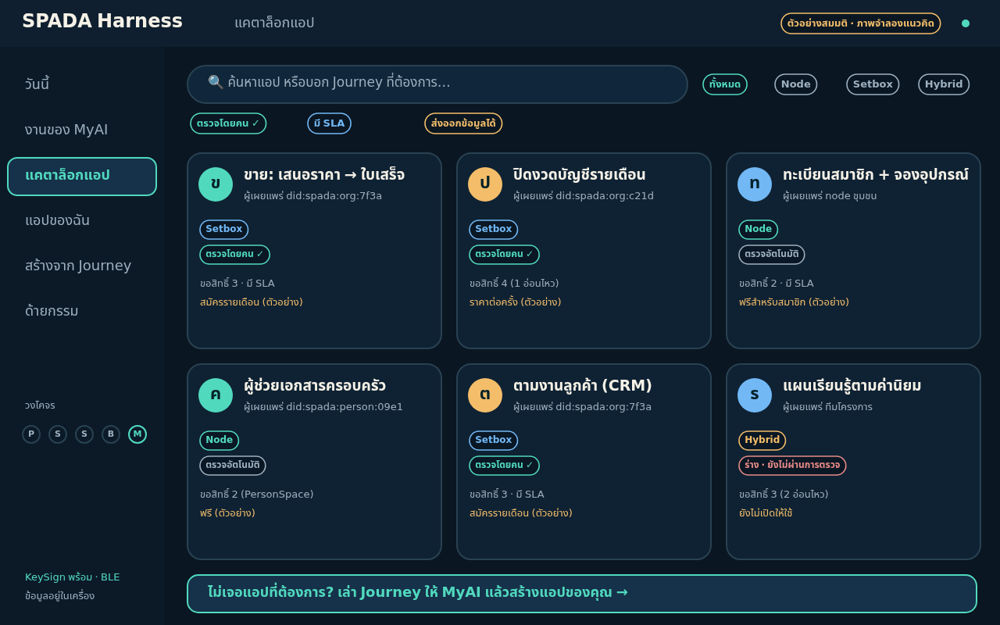 |
| 2 | โน้ตบุ๊ก | อ่านรายละเอียด: ใครเผยแพร่ ตรวจโดยใคร ขอสิทธิ์อะไร ต้องมีคะแนนเท่าไร SLA ทางออก | 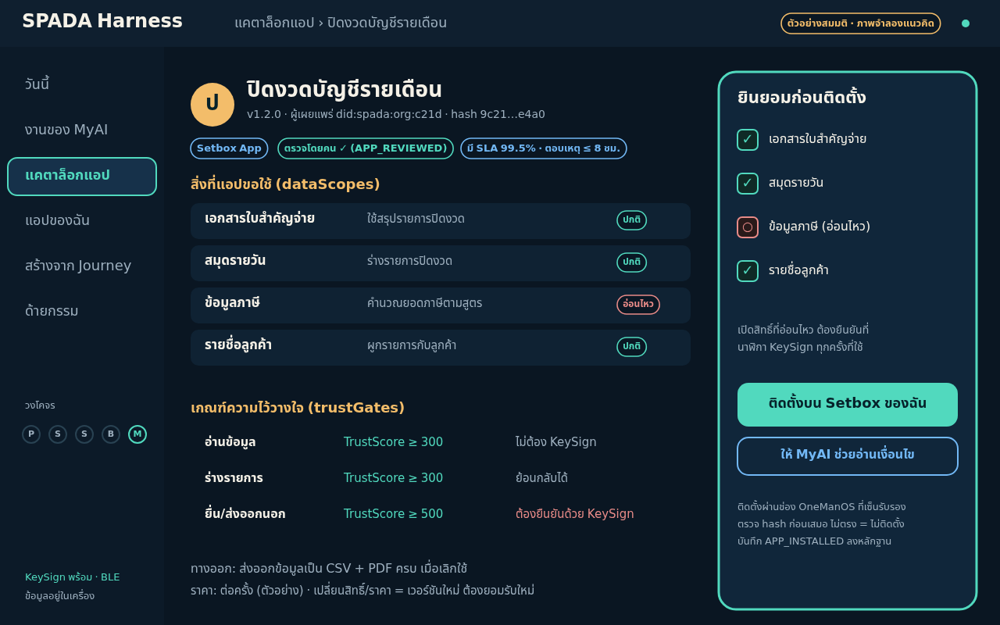 |
| 3 | โทรศัพท์ | ติ๊กเลือกสิทธิ์ที่ยินยอม (สิทธิ์อ่อนไหวเริ่มปิดไว้) | 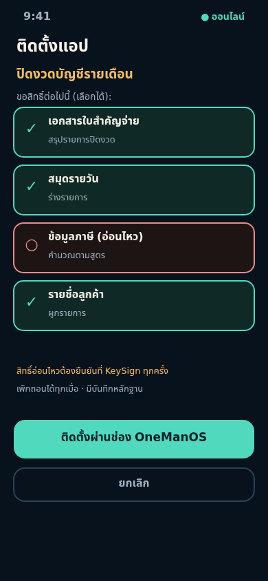 |
| 4 | ติดตั้ง | ผ่านช่อง OneManOS ที่เซ็นรับรอง ตรวจ hash ก่อนเสมอ (ไม่ตรง = ไม่ติดตั้ง) | — |
| 5 | นาฬิกา (ถ้าแอปขอสิทธิ์อ่อนไหว) | กดค้างยืนยัน |  |

ผลที่ตามมา: เกิดบันทึก `CONSENT_GRANTED`, `APP_INSTALLED` ในด้ายกรรม

### 4.3 การใช้แอปกับ MyAI (วงจรประจำวัน)
1. **เช้า:** โทรศัพท์สรุปสิ่งที่ MyAI ทำแล้ว (ย้อนกลับได้) สิ่งที่รออนุมัติ และงานวันนี้ 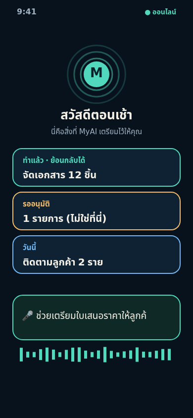
2. **สั่งงาน:** พูด/พิมพ์ เช่น "ช่วยเตรียมใบเสนอราคาให้ลูกค้ารายใหม่"
3. **แผน:** โน้ตบุ๊กแสดงแผนเป็นขั้น พร้อมป้าย A/B/C ผู้ใช้แก้ลำดับหรือตัดขั้นได้ 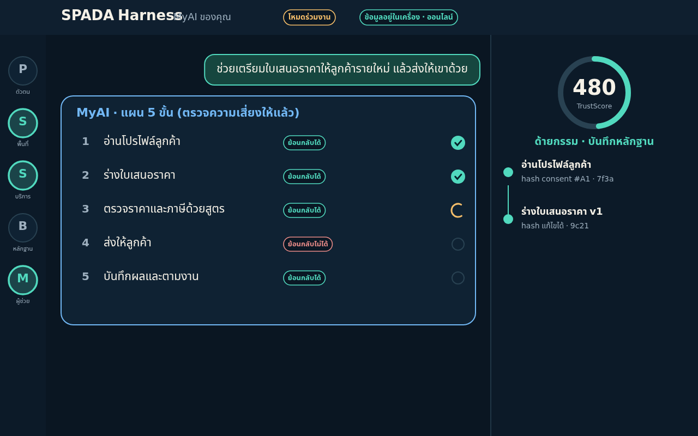
4. **ขั้น A:** MyAI ทำเอง (ย้อนกลับได้) สถานะ รอ→ทำ→เสร็จ
5. **ขั้น B/ย้อนกลับไม่ได้:** MyAI หยุด แสดงการ์ดขออนุมัติ 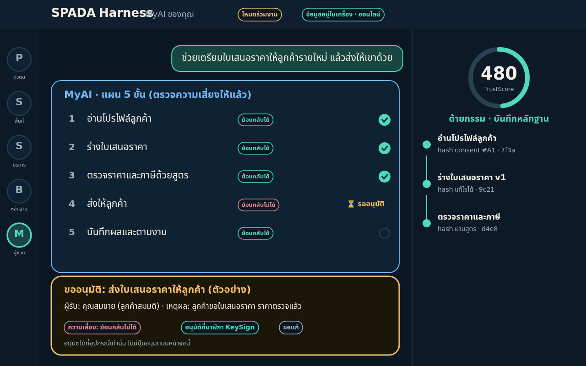 → โทรศัพท์เตือน 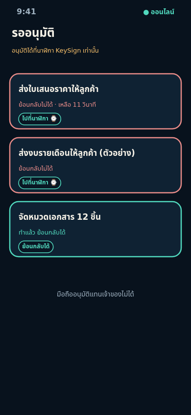 → กดค้างที่นาฬิกา 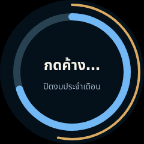 → 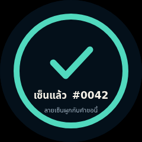
6. **ขั้น C:** MyAI ไม่ทำ แสดงข้อความ "เตรียมแฟ้มให้ผู้เชี่ยวชาญ" และเปิดงานให้คนรับผิดชอบ
7. **ปิดงาน:** ด้ายกรรมเพิ่มปม คะแนนความไว้วางใจอัปเดต (ตัวเลขตัวอย่าง)
8. **ผิดพลาด:** MyAI บันทึกบทเรียน ลดอิสระเฉพาะประเภทงานชั่วคราว 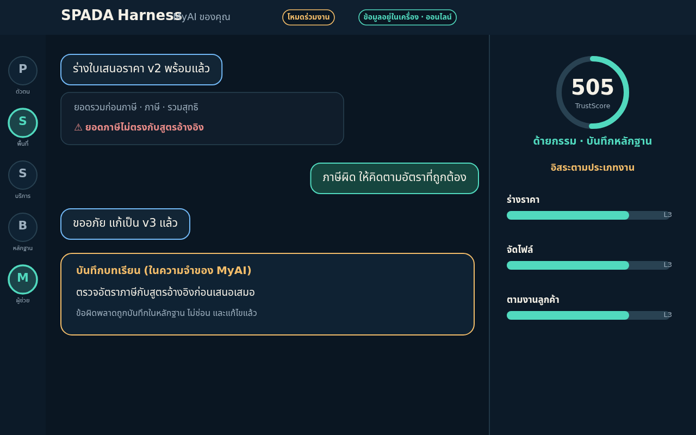
9. **ออฟไลน์:** ทำร่างในเครื่อง ซิงก์เมื่อออนไลน์ 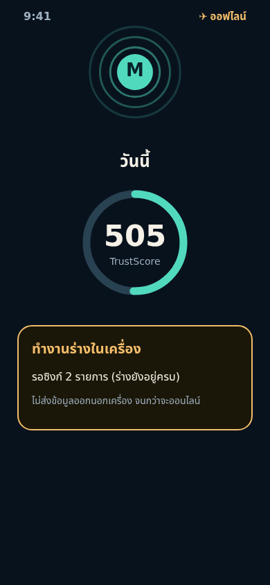

### 4.4 การจัดการแอปของฉัน
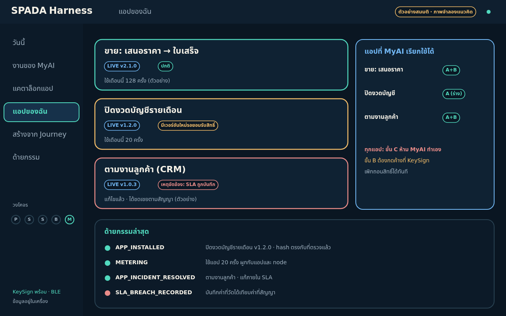
- เห็นสถานะ LIVE/เวอร์ชันใหม่รอยอมรับสิทธิ์/เหตุขัดข้อง และการใช้งานต่อแอป
- เลือกว่า MyAI เรียกแอปไหนได้ ขั้นไหน (A/B) เพิกถอนได้ทันที
- เลิกใช้: ได้ข้อมูลคืนตามรูปแบบที่ประกาศใน `export`

---

## 5. คู่มือผู้สร้าง: สร้างแอปจาก Journey/Workflow

**ผู้สร้างมี 2 ระดับ** (ข้อเสนอ — ต้องให้ Lead ตัดสินสิทธิ์จริง)
- **ผู้ใช้ทั่วไป:** เล่า Journey ให้ MyAI ร่างแอป/แบบฟอร์ม/สัญญา ส่งเข้าวงจรตรวจ (ไม่เผยแพร่เอง)
- **ผู้พัฒนา/เจ้าของ node:** เขียนแอปตามสัญญาที่อนุมัติ ผู้เผยแพร่ต้องมี TrustScore ≥ 500 ตามข้อเสนอใน ADR 0026 และแอปที่ขอสิทธิ์อ่อนไหวหรือแตะเงินต้องผ่านการตรวจโดยคน

### 5.1 ขั้นตอน 8 ขั้นจาก Journey ถึงแอปใน Catalog
| ขั้น | ทำอะไร | ผลลัพธ์ | ประตู |
|---|---|---|---|
| 1 | **เล่า Journey** (เสียง/ข้อความ/ตัวอย่างงานจริง) | บันทึกเล่าเรื่อง | — |
| 2 | **จัดเป็นขั้นตอน** MyAI ถามว่าขั้นไหนซ้ำ ขั้นไหนต้องตัดสินใจ | Workflow | เจ้าของยืนยันลำดับ |
| 3 | **ติดป้าย A/B/C** ทุกขั้น | ตารางความเสี่ยง | กฎ: ย้อนกลับไม่ได้/กฎหมาย/การเงิน = C หรือ B ที่ต้องกด KeySign |
| 4 | **ระบุข้อมูลและสิทธิ์** แต่ละขั้นอ่าน/เขียนข้อมูลอะไร ทำไม ละเอียดอ่อนไหม | `dataScopes` | น้อยที่สุดเท่าที่จำเป็น |
| 5 | **ร่างสัญญา** ผลิต/ใช้สัญญาข้อมูลอะไร ไม่ต่อฐานข้อมูลตรง | `integration` manifest | — |
| 6 | **C·I:** ลงทะเบียนแอป + ยื่นสัญญา | แอปสถานะ INSTRUCT | 🔒 คนอนุมัติสัญญา ก่อนเขียนโค้ด |
| 7 | **D·E:** สร้างตามสัญญา + ชุดทดสอบสัญญา + ตรวจต้านไซโล | หลักฐานทดสอบ | 🔒 คนยืนยันผล ก่อนแตะข้อมูลจริง |
| 8 | **R:** เปิดใช้จริง + เผยแพร่ใน Catalog (ข้อเสนอ ADR 0026) | แอป LIVE | สัญญาเปลี่ยน → กลับขั้น I |

หน้าจอ: 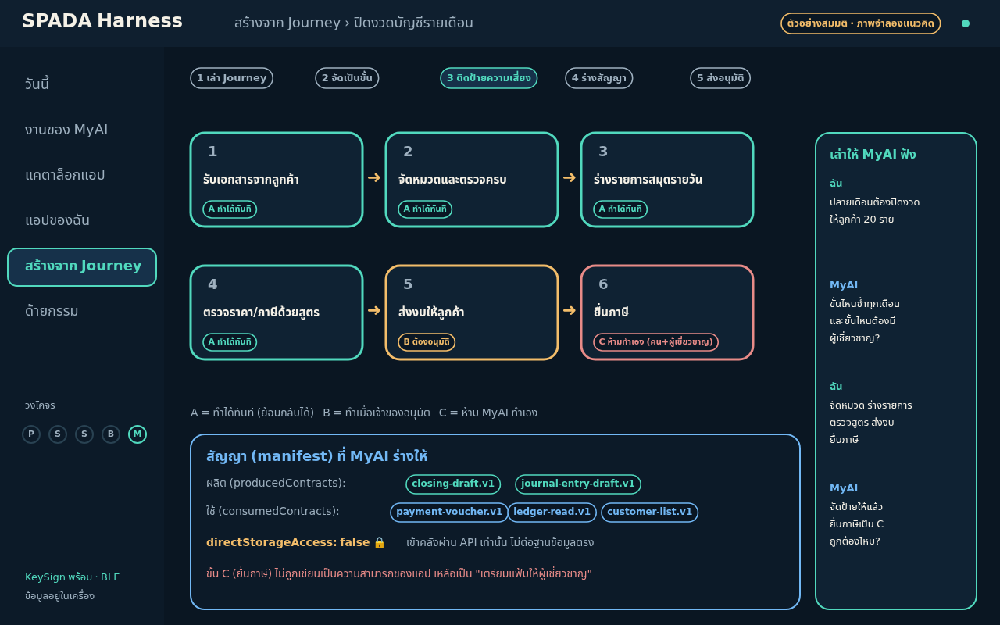 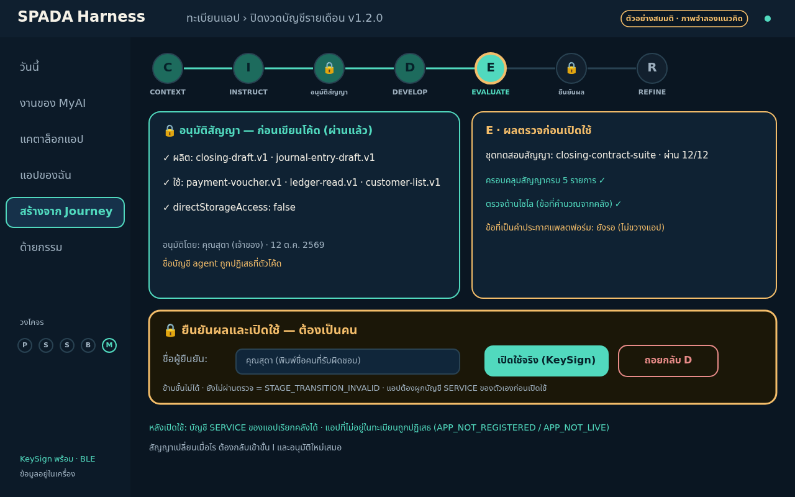

### 5.2 แบบฟอร์ม Journey Spec (ให้ MyAI กรอก/ผู้สร้างตรวจ)
```yaml
journey:
  id: month-end-close
  title: ปิดงวดบัญชีรายเดือนให้ลูกค้า
  owner: <ชื่อคนที่รับผิดชอบ>          # บังคับ (ต้องเป็นคน ตาม register ownerName)
  why: ลดงานซ้ำปลายเดือน และตรวจย้อนหลังได้
  replaces: ตารางคำนวณในแชตและไฟล์กระจาย
steps:
  - id: s1
    name: รับเอกสารจากลูกค้า
    tier: A                              # A ทำเอง / B ต้องอนุมัติ / C ห้ามทำเอง
    reads:  [{scope: payment-voucher, purpose: สรุปรายการปิดงวด, sensitivity: normal}]
    writes: []
    reversible: true
  - id: s5
    name: ส่งงบให้ลูกค้า
    tier: B
    external_effect: true                # ส่งออกนอกขอบเขต
    reversible: false
    approval: keysign                    # กดค้างที่นาฬิกา
  - id: s6
    name: ยื่นภาษี
    tier: C
    reason: กฎหมาย/ย้อนกลับไม่ได้ ต้องเป็นคน+ผู้เชี่ยวชาญ
    app_capability: prepare-file-for-professional   # แอปทำได้แค่เตรียมแฟ้ม
data_scopes: [...]                       # สรุปจากทุกขั้น
contracts:
  produces: [closing-draft.v1]
  consumes: [payment-voucher.v1, ledger-read.v1]
trust_gates: [{operation: read, minimumScore: 300}, {operation: external-send, minimumScore: 500, assertionRequired: true}]
sla: {availabilityPercent: 99.5, incidentResponseHours: 8}
export: {format: csv+pdf, description: ส่งออกเอกสารทั้งหมดเมื่อเลิกใช้}
```
**กฎการแปลง Spec → Manifest:** รวม `reads/writes` ของทุกขั้นเป็น `dataScopes` (ตัดซ้ำ) · ขั้น C ห้ามกลายเป็นความสามารถอัตโนมัติ · ขั้น B ที่ `reversible:false` ต้องมี `trustGates.assertionRequired:true` · ไม่มี `directStorageAccess` นอกจาก `false`

### 5.3 รายการตรวจของผู้สร้าง (ก่อนส่งอนุมัติ)
- [ ] ทุกขั้นมี tier และเหตุผล · ไม่มีขั้น C ที่ถูกทำให้เป็นอัตโนมัติ
- [ ] `dataScopes` น้อยที่สุด และมี `purpose` ภาษาคนอ่านรู้เรื่อง
- [ ] สิทธิ์อ่อนไหวปิดโดยค่าเริ่มต้น และต้องยืนยันที่ KeySign
- [ ] มี `export` ที่ผู้ใช้ได้ข้อมูลคืนครบ
- [ ] มี `sla` ถ้าแอปเก็บเงิน (ข้อเสนอ ADR 0026 คำถามที่ 4)
- [ ] ชุดทดสอบครอบคลุมสัญญาครบทุกตัว (ไม่งั้นเปิดใช้ไม่ได้)
- [ ] ผูกบัญชี SERVICE ของแอป (`bindService`) ก่อนเปิดใช้
- [ ] ข้อความแจ้งเตือนไม่มีปุ่มอนุมัติและไม่เปิดเผยรายละเอียดเมื่อหน้าจอล็อก

---

## 6. แผนผังหน้าจอทั้งหมด

### 6.1 โน้ตบุ๊ก/แท็บเล็ต (1280×800 ตรรกะ)
| รหัส | หน้าจอ | ภาพ | จุดประสงค์ |
|---|---|---|---|
| N1 | แคตาล็อกแอป |  | ค้น กรอง เทียบแอป เข้า "สร้างจาก Journey" |
| N2 | รายละเอียดแอป + ยินยอม |  | อ่านสัญญา เลือกสิทธิ์ ติดตั้ง |
| N3 | พื้นที่ทำงาน Harness (แผน) |  | บทสนทนา แผน 5 ขั้น ด้ายกรรม |
| N4 | ขออนุมัติ |  | การ์ดอนุมัติ ไม่มีปุ่มอนุมัติ |
| N5 | บทเรียนจากความผิดพลาด |  | แก้ไข บันทึกบทเรียน อิสระตามประเภทงาน |
| N6 | Journey Studio |  | เล่า จัดขั้น ติดป้าย A/B/C ร่างสัญญา |
| N7 | วงจร CIDER + ประตูมนุษย์ |  | อนุมัติสัญญา ตรวจ ยืนยันผล |
| N8 | แอปของฉัน |  | สถานะ การใช้ สิทธิ์ MyAI เหตุขัดข้อง |

### 6.2 โทรศัพท์ (390×844)
| รหัส | หน้าจอ | ภาพ |
|---|---|---|
| P1 | สรุปเช้า + สั่งด้วยเสียง |  |
| P2 | แคตาล็อก | 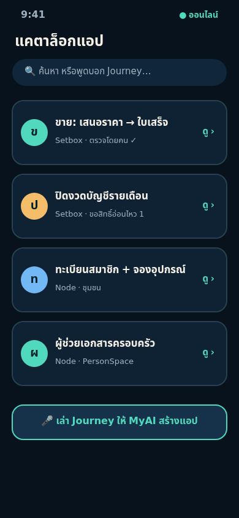 |
| P3 | ยินยอมก่อนติดตั้ง |  |
| P4 | MyAI กำลังทำงาน | 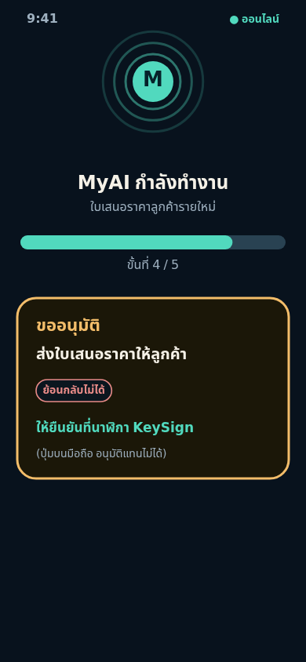 |
| P5 | กล่องรออนุมัติ (ชี้ไปนาฬิกา) |  |
| P6 | โหมดออฟไลน์ |  |

### 6.3 นาฬิกา KeySign (240×240 กลม; รายละเอียดใน SPD-MED-007)
| หน้าจอ | ภาพ |
|---|---|
| พร้อมใช้ | 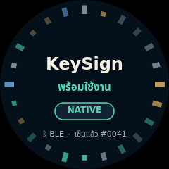 |
| คำขอเซ็น |  |
| กดค้าง |  |
| สำเร็จ |  |

### 6.4 แผนผังการนำทาง
```
โทรศัพท์:  สรุปเช้า ─ แคตาล็อก ─ รายละเอียด/ยินยอม ─ ติดตั้ง
                │                         │
                └── รออนุมัติ ──ชี้ไป──▶ นาฬิกา (กดค้าง)
โน้ตบุ๊ก:  วันนี้ ─ งานของ MyAI(แผน/อนุมัติ/หลักฐาน) ─ แคตาล็อก ─ แอปของฉัน ─ สร้างจาก Journey ─ ด้ายกรรม
```

---

## 7. Use Case แบบสมบูรณ์ (เรื่องสมมติทั้งหมด)

### UC1 · สำนักงานบัญชี: "ปิดงวดบัญชีรายเดือน" (Setbox App)
**ตัวละคร:** คุณสุดา (เจ้าของสำนักงาน, ผู้อนุมัติ), MyAI ของคุณสุดา, พนักงานผู้สอบทาน, ลูกค้า 20 ราย (สมมติ)
**ปัญหา:** ปลายเดือนเอกสารกระจาย ใครแก้อะไรตามย้อนยาก
**แอปที่ใช้:** "ปิดงวดบัญชีรายเดือน" (ภาพ N1/N2) ต่อยอดโมดูลจริงใน SetBox (ปิดงวด, ภ.พ.30, กระทบยอดธนาคาร ตาม APP-CATALOG)
| ขั้น | งาน | Tier | หมายเหตุ |
|---|---|---|---|
| 1 | รับเอกสารลูกค้า | A | จัดหมวด ตรวจครบ |
| 2 | ร่างรายการสมุดรายวัน | A | ย้อนกลับได้ |
| 3 | ตรวจราคา/ภาษีด้วยสูตร | A | ผลชนสูตร → แจ้งเตือนสีแดงให้คนดู |
| 4 | สอบทานโดยคนอื่น | B | หลัก "ผู้ตรวจต้องไม่ใช่ผู้เขียน" (ผู้จัดทำ ≠ ผู้สอบทาน) |
| 5 | ส่งงบให้ลูกค้า | B | ย้อนกลับไม่ได้ → กดค้าง KeySign |
| 6 | ยื่นภาษี | **C** | แอปทำได้แค่ "เตรียมแฟ้มให้ผู้เชี่ยวชาญ" |
**dataScopes:** เอกสารใบสำคัญจ่าย (ปกติ) · สมุดรายวัน (ปกติ) · ข้อมูลภาษี (**อ่อนไหว**) · รายชื่อลูกค้า (ปกติ)
**trustGates:** อ่าน/ร่าง ≥ 300 · ส่งออกนอก ≥ 500 + KeySign
**วิธีใช้ (มุมมองคุณสุดา):**
1. มือถือ : MyAI รายงานว่า "ลูกค้า 20 ราย รอปิดงวด 6 ราย"
2. แคตาล็อก : ติดตั้งแอป ยินยอมสิทธิ์ ยกเว้นข้อมูลภาษีไว้ก่อน
3. สั่ง: "ปิดงวดลูกค้ากลุ่ม ก" → แผนขึ้นโน้ตบุ๊ก ขั้น 1–3 รันเอง
4. เจอยอดภาษีไม่ตรงสูตร → การ์ดแดง → คุณสุดาสั่งแก้ → MyAI บันทึกบทเรียน 
5. ผู้สอบทานตรวจ (ขั้น 4) → คุณสุดากดค้างส่งงบ (ขั้น 5) → ด้ายกรรมเพิ่มปม
6. ขั้น 6: แอปสร้างแฟ้มส่งให้ผู้เชี่ยวชาญ คนยื่นเอง
**หลักฐาน:** ทุกขั้นเป็นปมพร้อม hash และผู้อนุมัติ (ชื่อคน) ตอบคำถามผู้สอบบัญชี "ตัวเลขนี้มาจากไหน" ได้
**ตัวชี้วัดที่ควรวัด:** ชั่วโมงงานซ้ำต่อเดือน, จำนวนข้อผิดพลาดที่จับได้ก่อนส่ง, เวลาจากเอกสารครบถึงส่งงบ (ยังไม่มีตัวเลขจริง)
**ที่ยังไม่มี/ต้องตัดสิน:** แอปนี้ยังไม่อยู่ใน Catalog จริง · ขอบเขตกฎหมายวิชาชีพบัญชี · การตรวจโดยคนสำหรับ scope อ่อนไหว

### UC2 · เจ้าของธุรกิจคนเดียว: "ใบเสนอราคาแรกที่ได้เงิน" (OPB OS)
**ที่มา:** doc 263 (Offer Gate, Revenue Gate) · **ผู้ใช้:** คุณต้น ที่ปรึกษาอิสระ (สมมติ)
**แอป:** "ผู้ช่วยข้อเสนอแรก" (Hybrid: หน้าบ้านบน Setbox ใช้ออฟไลน์ได้ + ชุดเอกสารบน WorkSpace)
| ขั้น | งาน | Tier |
|---|---|---|
| 1 | สรุปโปรไฟล์ธุรกิจ 5 คำถามแรก (ประเทศ/ขายอะไร/ให้ใคร/สถานะ/เป้ารายได้) | A |
| 2 | ร่างข้อเสนอขาย (Offer Sheet) และโครง proposal | A |
| 3 | ตรวจรายการกฎหมาย/ภาษีที่ต้องยืนยัน | A (เตรียมรายการ) |
| 4 | ส่งข้อความหา prospect / สร้างเอกสารพร้อมใช้ / ร่าง invoice | B |
| 5 | จดทะเบียน ยื่นภาษี เปิดบัญชี เซ็นสัญญา รับ-จ่ายเงิน | **C** |
**WorkSpace:** `OnePersonBusiness/{ชื่อธุรกิจ}` โครง 10 โฟลเดอร์ตาม doc 263 (01-business-profile … 10-retrospectives)
**วิธีใช้:** เริ่มจาก Journey สำเร็จรูป 7 ด่าน → MyAI ถาม 5 ข้อ → สร้างโครง WorkSpace → ร่าง offer → คุณต้นอนุมัติส่งหา prospect (กดค้าง) → ติดตามผ่าน pipeline
**ผลที่ตั้งเป้า (30/60/90 วัน ตาม doc 240):** สนทนา ≥ 3 ราย ภายในวันที่ 15–30 · ลูกค้ารายแรกวันที่ 31–60 (เป็นเป้าหมายจากเอกสาร ไม่ใช่ผลที่พิสูจน์)
**ที่ยังไม่มี:** skill `one-man-company-business-builder` เป็นสเปก; ต้องตรวจกฎหมายแต่ละประเทศโดยผู้เชี่ยวชาญ

### UC3 · ชุมชน/สหกรณ์: "ทะเบียนสมาชิกและจองอุปกรณ์ส่วนกลาง" (Node App)
**ผู้ใช้:** สมาชิกสหกรณ์ชุมชนสมมติ, ผู้ดูแลโหนด, อาสา Steward (ช่วยผู้สูงอายุ/ผู้ไม่มีอุปกรณ์ ตาม MEMBER-ECONOMY M9)
**แอป:** Node App บนโหนดชุมชน (ภาพ P2 รายการที่ 3)
| ขั้น | งาน | Tier |
|---|---|---|
| 1 | สมาชิกดูอุปกรณ์ส่วนกลางที่ว่าง | A |
| 2 | จองอุปกรณ์ | B (บันทึก ServiceBook; ยกเลิกได้ตามกติกา) |
| 3 | ชำระ/ตัดเงินมัดจำ | **C/B + KeySign** (เกี่ยวกับเงิน) |
| 4 | ลงคะแนนในที่ประชุม | B + ยืนยันตัวตน (ดูกติกาโหนด ADR 0005 ที่รอชุมชนรับรอง) |
**Assisted access:** Steward ช่วยดำเนินการแทนได้เฉพาะที่ผู้ใช้ให้ความยินยอม และการยืนยันยังเป็นของผู้ใช้ (หรือกลไกทดแทนที่ชุมชนกำหนด) — **ต้องออกแบบ** เพราะผู้ไม่มีอุปกรณ์กด KeySign เองไม่ได้
**ข้อมูล:** อยู่ที่โหนดบ้านของสมาชิก แอปขอดูผ่าน consent ไม่เก็บสำเนาถาวร (ADR 0026 §7)
**ที่ยังไม่มี/ต้องตัดสิน:** ชุมชนจริง (ยังไม่มีผู้ใช้/LOI), กติกาโหนด (ADR 0005 รอรับรอง), วิธียืนยันตัวตนแทนสำหรับผู้ไม่มีอุปกรณ์

### UC4 · บุคคลทั่วไป: "ผู้ช่วยเอกสารครอบครัว" (Node App + PersonSpace)
**ผู้ใช้:** คุณนก พนักงานบริษัท (ตัวละครจาก doc 247)
| ขั้น | งาน | Tier |
|---|---|---|
| 1 | จัดหมวดเอกสาร (กรมธรรม์ ภาษีที่ดิน ผลตรวจ) ใน PersonSpace | A |
| 2 | เตือนวันหมดอายุ/ครบกำหนด | A |
| 3 | ส่งสำเนาให้บุคคลที่ระบุ | B (ส่งออกนอก PersonSpace) |
| 4 | ชำระเงิน/ลงนาม/ต่อกรมธรรม์ | **C** |
**dataScopes:** เอกสารส่วนบุคคล (**อ่อนไหว**) ทั้งหมดอยู่ในเครื่อง ประมวลผลโดย MyAI บนเครื่อง
**วิธีใช้:** บอก MyAI "ช่วยจัดเอกสารครอบครัว" → แคตาล็อกเสนอแอป → ยินยอมเฉพาะโฟลเดอร์ → MyAI จัดหมวดและเตือน → ส่งสำเนาให้คู่สมรสต้องกดค้างที่นาฬิกา
**ที่ยังไม่มี:** PersonSpace/MyAI ยังเป็นต้นแบบ; ต้องประเมิน PDPA และให้ผู้ใช้เปิด/ปิดความจำได้

---

## 8. ระบบออกแบบ (Design System) และกติกา UX

### 8.1 โทเค็น
| โทเค็น | ค่า | ใช้เมื่อ |
|---|---|---|
| พื้นหลัง | `#0B1B2B` / ชั้นแผง `#122535` / เส้น `#294252` | พื้นและการ์ด |
| ตัวอักษรหลัก | `#F5F1E7` · รอง `#9EB0BF` | ข้อความ |
| เขียว/teal | `#51D9BE` | สำเร็จ ย้อนกลับได้ (A) การทำงานของ MyAI |
| ทอง | `#F3BD6A` | ต้องดำเนินการ ต้องอนุมัติ (B) เวลา |
| แดง | `#E88B88` | ย้อนกลับไม่ได้ ห้ามทำเอง (C) ปฏิเสธ ข้อผิดพลาด |
| ฟ้า | `#72B8F5` | ข้อมูล แผน การเชื่อมต่อ |
| ฟอนต์ | Noto Sans Thai (สำรอง sans-serif) | ทุกที่ |
สีต้องคู่กับข้อความหรือไอคอนเสมอ (ไม่พึ่งสีอย่างเดียว) คอนทราสต์ตัวอักษร ≥ 4.5:1

### 8.2 ขนาด (ตรรกะ)
โน้ตบุ๊ก: ตัวเนื้อหา ≥ 16 · ชื่อหน้า 24–28 · โทรศัพท์: ≥ 15 · นาฬิกา: ≥ 14 และเนื้อหาอยู่ในรัศมี ≤ 105 จากจุดกลาง

### 8.3 ส่วนประกอบ (component) ที่ต้องมี
บทสนทนา (bubble) · การ์ดแผน + แถวขั้น (ป้าย tier, สถานะ รอ/ทำ/เสร็จ/รออนุมัติ) · การ์ดขออนุมัติ (ไม่มีปุ่มอนุมัติ) · ปมด้ายกรรม · วงแหวน TrustScore · แถบอิสระตามประเภทงาน · การ์ดแอป · แผงยินยอม (สวิตช์ต่อ scope) · ตัวนำทางวงโคจร · แบนเนอร์ออฟไลน์ · ป้ายแจ้งเตือน 4 แบบ (ข้อมูล/ต้องดำเนินการ/สำเร็จ/เตือน) · ช่องกรอกชื่อผู้รับผิดชอบ (human gate) · ขั้นวงจร CIDER

### 8.4 กฎ UX 12 ข้อ
1. **อนุมัติที่ตัวตน:** งานเสี่ยงอนุมัติได้เฉพาะ KeySign ไม่มีปุ่มอนุมัติบนจอมือถือ/โน้ตบุ๊ก
2. **แสดงก่อนทำ:** ใครขอ ขออะไร เสี่ยงแค่ไหน ย้อนกลับได้ไหม ก่อนทุกการอนุมัติ
3. **ข้อมูลน้อยที่สุด:** แสดง `dataScopes`+`purpose` ก่อนติดตั้ง สิทธิ์อ่อนไหวปิดไว้เป็นค่าตั้งต้น
4. **ย้อนกลับได้เป็นค่าตั้งต้น:** ขั้น A มีปุ่มย้อน (checkpoint) ขั้นย้อนไม่ได้ต้องเตือนชัด
5. **ไม่ซ่อนความผิดพลาด:** แสดงเมื่อ MyAI ทำพลาด บันทึกบทเรียน ผู้ใช้เป็นคนแก้
6. **หลักฐานอยู่ใกล้งาน:** ด้ายกรรมแสดงข้างงาน ไม่ต้องไปหาในเมนูลึก
7. **ภาษาคน:** ไม่ใช้ศัพท์เทคนิคกับผู้ใช้ปลายทาง ใช้ "ย้อนกลับไม่ได้" แทน irreversible
8. **ไม่เร่ง:** ไม่ใช้ตัวนับเวลาบีบนอกจากกำหนดจริง (เช่น 15 วินาทีของการกด KeySign)
9. **ไม่กดดันด้วยคะแนน:** ไม่แสดงการเทียบกับคนอื่น ไม่ใช้คะแนนเป็นเกมแข่งขัน
10. **ออฟไลน์ก่อน:** ทำงานร่างได้ ซิงก์ทีหลัง บอกสถานะชัด
11. **เข้าถึงได้:** เสียง/ตัวอักษรใหญ่ รองรับผู้สูงอายุ ลดการเคลื่อนไหวได้ ไม่พึ่งสีอย่างเดียว
12. **ความเป็นเจ้าของ:** ปุ่ม "ส่งออกข้อมูล" และ "เพิกถอนสิทธิ์" เห็นได้เสมอ

### 8.5 ข้อห้าม (anti-pattern)
- ปุ่ม "อนุมัติทั้งหมด" สำหรับงาน B/C · การอนุมัติอัตโนมัติจากระยะไกล · ซ่อนสิทธิ์อ่อนไหวในรายการยาว · แจ้งเตือนที่มีปุ่มอนุมัติ · ใช้ชื่อบัญชี agent เป็นผู้อนุมัติ (ถูกปฏิเสธที่โค้ดอยู่แล้ว ห้าม UI พยายามส่ง) · เรียกอุปกรณ์ว่า FIDO2 (PKT-R9) · แสดงข้อมูลลูกค้าบนหน้าจอล็อก

### 8.6 ข้อความแจ้งเตือน (สรุป)
| ประเภท | สี | ตัวอย่าง |
|---|---|---|
| ข้อมูล | ฟ้า | เชื่อมต่อ BLE แล้ว |
| ต้องดำเนินการ | ทอง | มีคำขอเซ็นใหม่ |
| สำเร็จ | เขียว | เซ็นสำเร็จ #0043 |
| เตือน/ปฏิเสธ | แดง | ปฏิเสธเครื่องที่ไม่รู้จัก |
รายละเอียดกติกา (ไม่มีปุ่มอนุมัติ ไม่เปิดเผยบนจอล็อก จำกัดความถี่) ดู SPD-MED-007 หัวข้อ 3.1

---

## 9. แมปหน้าจอ ↔ ระบบหลังบ้าน
| หน้าจอ | การกระทำของผู้ใช้ | ระบบ/ฟังก์ชัน | บันทึกหลักฐาน |
|---|---|---|---|
| N1 แคตาล็อก | ค้น/กรอง | service-registry (`ISPADAServiceListing`) ขยายเป็น manifest (ADR 0026 A1) | — |
| N2/P3 ยินยอม | ติ๊ก scope, ติดตั้ง | consent-service, entitlement-service; ช่อง OneManOS ตรวจ hash | `CONSENT_GRANTED`, `APP_INSTALLED` (ข้อเสนอ) |
| N3 พื้นที่ทำงาน | สั่ง/ดูแผน | MyAI → BookChain → Service (ไม่ข้ามชั้น) | ปมด้ายกรรมต่อขั้น |
| N4 ขออนุมัติ | (ชี้ไปนาฬิกา) | ISPADAActorAssertion + KeySign (SPD-MED-007, PKT-R5/R7) | ลายเซ็น + counter |
| N6 Studio | เล่า/จัดขั้น/ติดป้าย | MyAI ร่าง manifest (on-device) | — |
| N7 CIDER | อนุมัติสัญญา/ยืนยันผล | `register` · `submitVersion` · `approveVersion` · `beginEvaluation` · `returnToDevelop` · `activateVersion` · `bindService` · `retire` | audit ของทะเบียน |
| N8 แอปของฉัน | เปิด/ปิดสิทธิ์ MyAI, เลิกใช้ | entitlement, metering (`appId`/`hostNodeId` ข้อเสนอ), `export` | `ENTITLEMENT_*`, `METERING_USAGE_RECORDED`, `SLA_BREACH_RECORDED` |
| วงแหวนคะแนน | ดูคะแนน | trust-score-service (คำนวณฝั่งเซิร์ฟเวอร์ ADR 0002) | — |
| การแจ้งเตือน | อ่าน | ช่อง push (ต้องตัดสิน PDPA) | บันทึกการแจ้งเตือน |

**หลักเชื่อมต่อ:** แอปเรียกคลังผ่านบัญชี SERVICE ของตัวเองเท่านั้น · ไม่ต่อฐานข้อมูลตรง · แอปที่ไม่อยู่ในทะเบียนถูก `403 APP_NOT_REGISTERED` · ผู้ใช้ที่เป็นคนยังเข้าได้ตามสิทธิ์เดิม (ทะเบียนไม่แตะ)

---

## 10. เกณฑ์ตรวจรับ การทดสอบ และลำดับการสร้าง

### 10.1 ลำดับการสร้าง (ข้อเสนอ ไม่มีกำหนดเวลา)
| เฟส | ส่งมอบ | เกณฑ์ผ่าน |
|---|---|---|
| H0 | ต้นแบบคลิกได้ (ภาพในคู่มือ) ทดสอบกับผู้ใช้ 5 คน/กลุ่ม | ผู้ใช้เข้าใจ A/B/C และรู้ว่าอนุมัติที่ไหน โดยไม่ต้องอ่านคู่มือ |
| H1 | Harness เว็บ (โน้ตบุ๊ก) ต่อ App Catalog Registry จริงของ SetBox: N1,N2,N7,N8 | ลงทะเบียน→ยื่นสัญญา→อนุมัติ→ตรวจ→เปิดใช้ ผ่าน UI ได้จริง ประตูมนุษย์ปฏิเสธ agent |
| H2 | แอปโทรศัพท์ (PWA/แอป) P1–P6 + แจ้งเตือน | ทำร่างออฟไลน์/ซิงก์ได้ · แจ้งเตือนไม่มีปุ่มอนุมัติ |
| H3 | เชื่อม KeySign (นาฬิกา) | ลายเซ็นผูกกับแฮชของคำขอ (PKT-R7) ใช้ได้ทั้ง 1 กด = 1 ลายเซ็น |
| H4 | Journey Studio + MyAI ร่าง manifest (ต้องมี MyAI on-device) | manifest ที่ร่างผ่าน `readManifest` และผู้สร้างตรวจแก้ได้ |
| H5 | Catalog สาธารณะ (ADR 0026 A1–A4) | ตาม ADR 0026 |

### 10.2 การทดสอบที่ต้องมี
- **สัญญา:** ชุดทดสอบครอบคลุมทุก `producedContracts/consumedContracts` (เงื่อนไขเปิดใช้จริงใน `activateVersion`)
- **ความปลอดภัย:** พยายามอนุมัติด้วยชื่อ agent (ต้องถูกปฏิเสธ), เรียกคลังด้วยบัญชีแอปที่ไม่ลงทะเบียน (ต้อง 403), ข้ามขั้น CIDER (ต้อง `STAGE_TRANSITION_INVALID`), hash ไม่ตรงตอนติดตั้ง (ต้องไม่ติดตั้ง)
- **UX:** ทดสอบการใช้งานกับผู้ใช้จริง (ผู้สูงอายุ/ผู้ไม่ถนัดเทคโนโลยีรวมอยู่ด้วย) วัด: อัตราที่ผู้ใช้เข้าใจป้าย A/B/C, อัตราที่ผู้ใช้อ่านสิทธิ์อ่อนไหวก่อนยินยอม, ความผิดพลาดในการอนุมัติ
- **ออฟไลน์:** ร่างไม่หาย ซิงก์ไม่ซ้ำ
- **การแจ้งเตือน:** ไม่เปิดรายละเอียดบนหน้าจอล็อก ไม่มีปุ่มอนุมัติ
- **การเข้าถึง:** คอนทราสต์ ขนาดตัวอักษร โหมดลดการเคลื่อนไหว

### 10.3 Definition of Done ของ "แอปหนึ่งตัวจาก Journey"
Journey Spec ผ่านรายการตรวจ 5.3 · สัญญาอนุมัติโดยคน · ชุดทดสอบสัญญาครบ · ตรวจต้านไซโลผ่านข้อที่คำนวณ · ผูกบัญชี SERVICE · ยืนยันผลโดยคน · มีหน้าจอครบ (รายละเอียด/ยินยอม/ใช้งาน/ขออนุมัติ/แอปของฉัน) · ผ่านการทดสอบ UX

---

## 11. ความเสี่ยงและสิ่งที่ต้องตัดสิน
| # | เรื่อง | ผู้ตัดสิน |
|---|---|---|
| 1 | ยืนยันใช้ D2.1 เป็นหลักอิสระของ MyAI; สถานะ ADR 0024/0026 (ยัง Proposed) | Lead |
| 2 | ใครสร้าง/เผยแพร่แอปได้ (เกณฑ์ TrustScore ≥ 500 เป็นข้อเสนอ) และใครตรวจแอประดับที่ต้องใช้คน | Lead/ชุมชน |
| 3 | นโยบายเซ็นไฟล์ Setbox App กับ OneManOS (ใครถือกุญแจ) | Lead + OneManOS |
| 4 | SLA ขั้นต่ำ, สัดส่วนแบ่งรายได้ (ส่วนเครือข่ายเก็บรวมไม่เกิน 20% ตามข้อเสนอ ตัวเลขยังไม่กำหนด) | Lead |
| 5 | MyAI เป็นแอปใน Catalog หรือเป็นส่วนของแพลตฟอร์ม | Lead |
| 6 | ช่องทาง push ไปโทรศัพท์ (เมทาดาตาเห็นโดยผู้ให้บริการ) และ PDPA | Lead + กฎหมาย |
| 7 | การยืนยันแทนสำหรับผู้ไม่มีอุปกรณ์ (Steward) | ชุมชน + Lead |
| 8 | ESP32-C3 vs RP2350 และการแตะทัชนับเป็นการกดปุ่มหรือไม่ (SPD-MED-007) | Lead |
| 9 | ทีม/ผู้ตรวจอิสระ/การทดสอบกับผู้ใช้จริง | Lead |
**ความเสี่ยงทางเทคนิค:** ด่านทะเบียนกันแอป แต่กันไม่ได้ถ้าคนเอาบัญชีตัวเองให้แอปใช้ (ต้องใช้วินัยและการตรวจ) · MyAI ร่าง manifest ผิดพลาดต้องมีคนตรวจ · ผู้ใช้อาจกดยินยอมโดยไม่อ่าน (ต้องออกแบบให้อ่านง่ายและวัดผล)

---

## ภาคผนวก: กรอบ "กฎแห่งกรรมดิจิทัล" และความเป็นธรรม
- **กรอบ:** เหตุ (การกระทำ) → หลักฐาน (บันทึกต่อท้ายอย่างเดียว) → ผล (สิทธิ์/ความไว้วางใจ) → ทบทวน (อุทธรณ์/แก้ไข)
- **ที่มีจริง:** TrustScore คำนวณฝั่งเซิร์ฟเวอร์ ส่งเองไม่ได้ (ADR 0002); เกณฑ์เรียกบริการ 300 · งานอ่อนไหว 500 · อัตโนมัติ 700 · ข้ามโหนด 900 (ADR 0024); ตัวอย่างเหตุการณ์ให้คะแนนมีเพียง MEMBER_REGISTERED +50 และ MEMBER_REFERRAL +25 → **ตัวเลขคะแนนในภาพเป็นตัวอย่าง**
- **ข้อเสนอความเป็นธรรม (ต้องให้ชุมชนตัดสิน):** กติกาเดียวกันทุกฝ่าย (เจ้าของ MyAI ผู้ให้บริการ) · ผิดพลาดแก้ได้และอุทธรณ์ด้วยหลักฐาน · ลดอิสระเฉพาะประเภทงานชั่วคราวเมื่อทำพลาด ฟื้นเมื่อทำถูกซ้ำ · ป้องกันการแกล้ง (รีวิวต้องมีธุรกรรมจริง กักค่าผิดปกติ จำกัดความถี่) — ที่มา doc 160 ส่วนความเสี่ยง Social Mirror (ยังเป็นสเปก ไม่พบโค้ด)
- **ความเสี่ยง:** การเล่นระบบคะแนน อคติเชิงระบบ แรงกดดันทางสังคมจากคะแนน และการสร้างโปรไฟล์ที่กระทบสิทธิ์ (PDPA) ต้องประเมินและมีผู้ตรวจอิสระก่อนใช้จริง
- **ตัวเลขการเงินและผลลัพธ์ทางธุรกิจ** ไม่อยู่ในคู่มือนี้

---

## ประวัติเอกสาร
| เวอร์ชัน | วันที่ | รายละเอียด |
|---|---|---|
| 0.1 | 2026-10-02 | ข้อเสนอ UX และกรอบกฎแห่งกรรมดิจิทัล (ประกอบวิดีโอ 240 วินาที) |
| 0.2 | 2026-10-02 | คู่มือเต็ม: App Catalog, สร้างแอปจาก Journey/Workflow, ภาพหน้าจอ 18 ภาพ, Use Case 1–4, ระบบออกแบบ, แมปหลังบ้าน |
